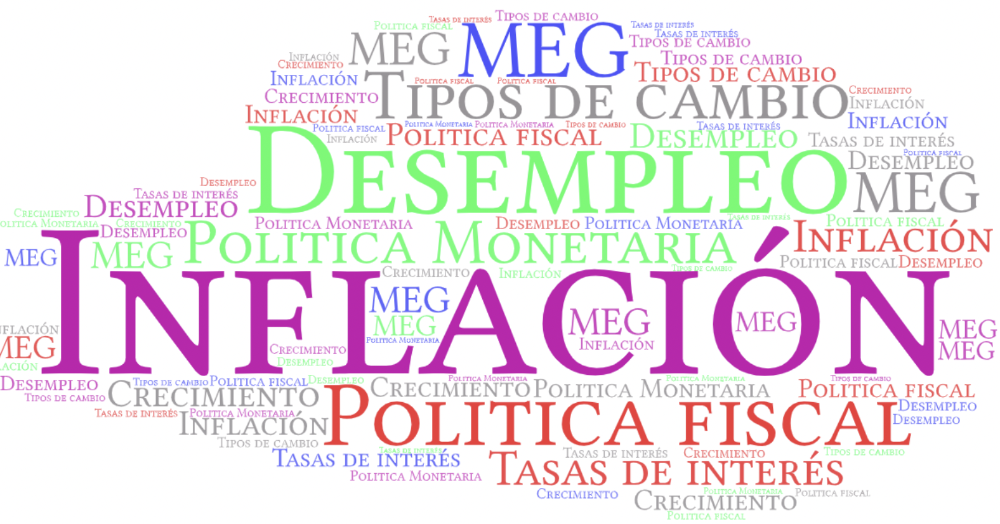
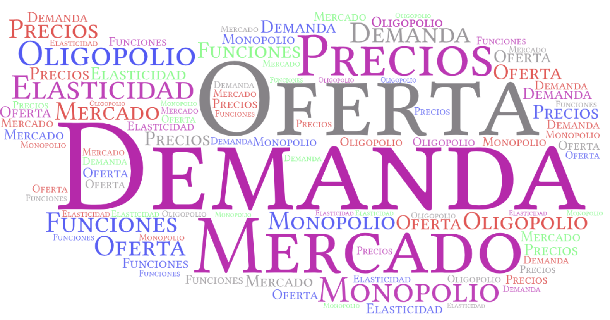
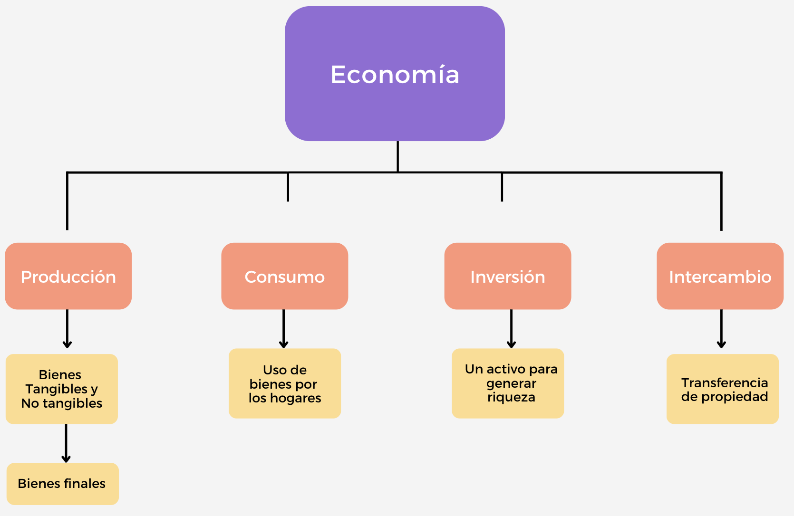

```{r meta, echo=FALSE}
library(metathis)
meta() %>%
  meta_general(
    description = "Clases de Economía (Introducción)",
    generator = "xaringan and remark.js"
  ) %>% 
  meta_name("github-repo" = "keynes37/xaringan-rladies-xalapa") %>% 
  meta_social(
    title = "Introducción a la economía",
    url = "https://spcanelon.github.io/xaringan-rladies-xalapa",
    image = "https://github.com/spcanelon/xaringan-rladies-xalapa/blob/master/xaringan-rladies-xalapa-general.png",
    image_alt = "Diapositiva para introducción a la economía",
    og_type = "website",
    og_author = "Carlos Yanes",
    twitter_card_type = "summary_large_image",
    twitter_creator = "@keynes37"
  )
```

```{r configuracion, include = FALSE}
library(knitr)
library(tidyverse)
library(datos)
library(fontawesome)
library(emo)
library(xaringanExtra)
# set default options
opts_chunk$set(echo=FALSE,
               warning=FALSE,
               collapse = TRUE,
               dpi = 300)
knit_engines$set("yaml", "markdown")
xaringanExtra::use_tile_view()
xaringanExtra::use_clipboard()
xaringanExtra::use_share_again()
xaringanExtra::style_share_again(
  share_buttons = c("twitter", "linkedin", "pocket")
)
```

class: right, middle, inverse, titular
background-image: url(images/bn.jpeg)
background-size: contain
background-position: -10cm 20%

<!---->

# `r rmarkdown::metadata$title` 
## **`r rmarkdown::metadata$subtitle`**
### `r rmarkdown::metadata$author`
### `r rmarkdown::metadata$date`

[`r fontawesome::fa("link")` Departamento de Economía](https://www.uninorte.edu.co/en/web/economia)

---
name: saludo
layout: false
class: inverse, middle, center

# Sobre mí


## Carlos Andrés Yanes Guerra `r emo::ji("colombia")`

### Profesor Asistente

.fade[Universidad del Norte<br> Barranquilla, Atlantico, Col]

[`r fontawesome::fa("envelope")` cayanes@uninorte.edu.co](https://www.uninorte.edu.co/en/web/economia)
[`r fontawesome::fa("github")` @keynes37](https://github.com/keynes37)

---
# Atención a estudiantes

--

🙂 Departamento de economía Bloque .hi[D] Oficina: .hi[2-15], días: .hi-purple[10:30] Lunes

⚠️ Los correos (emails) ✉️ se responden por orden de .hi-purple[llegada]

❗️ Recuerde que cuenta con un equipo **integral** de recursos de apoyo en la Universidad.

---
class: middle, center
background-image: url(https://media.giphy.com/media/xUPGGDNsLvqsBOhuU0/giphy.gif)
background-size: cover
---
class: center, middle
# Bienvenido(a)s

----


---
class: inverse, middle

# Lo importante de la sesión

----

--

## Preguntar por todo (*pero es todo*) `r emo::ji("dollar")`

--

## Aprender, preguntar y seguir aprendiendo `r emo::ji("smile")`

--

## Leer y preparar clases de temas antes de las sesiones `r emo::ji("nerd")`

---
# Lo importante de la sesión

--

<span style="color:blue"> **Aprender, preguntar y seguir aprendiendo** </span>

--

Siempre tengan en cuenta:

--

- Respeto hacia los .hi[demás] y a sus .hi-purple[opiniones] 
- Asistir a todas las sesiones de la clase
- Conocer el [Syllabus](https://uninorte.edu.co/) de la asignatura en **Brightspace**
- Tener presente los recursos de la biblioteca [Karl Parrish](https://www.uninorte.edu.co/web/biblioteca/)

---
# Lo importante de la sesión

--

### Aprender de las reglas de juego

--

+ La universidad es un cúmulo de **Retos**

--

+ Siempre va a depender de uno .hi[mismo(a)]

--

+ El abanico de posibilidades siempre es grande en la medida que nos .hi[concentramos]

--

#### Sobre notas

--

- Hay materias que tienen mas (créditos) que otras. P.e:

--

.grey[Cálculo (4)], .pink[Introducción (3)], .orange[Electiva (2)]

--

*Escenario 1*

--

$$\text{Notas}\,=3.0(\color{#8AA19E}{4})+3.5(\color{#e64173}{3})+4.9(\color{#FFA500}{2})=32.3$$

 $$\text{Notas}\,=\frac{Promedio}{\text{Total creditos matriculados}}= \frac{32.3}{9}=3.6$$
---
# Lo importante de la sesión

--
*Escenario 2*

--

$$\text{Notas}\,=2(\color{#8AA19E}{4})+2.3(\color{#e64173}{3})+4.9(\color{#FFA500}{2})=24.7$$

$$\text{Notas}\,=\frac{Promedio}{\text{Total creditos matriculados}}= \frac{24.7}{9}=2.74$$

--

+ Las notas son .blue[importantes] pero no lo son **todo**.

--

+ En las .hi[materias] también se hacen cálculos ponderados de acuerdo a lo que el profesor estime, siguiendo y acorde al .red[reglamento estudiantil].

--

| Requerimientos     | Fecha                                | Ponderador |
| ------------------ | ------------------------------------ | ---------- |
| Parcial 1          | Hasta la semana 5                     | 25%        |
| Parcial 2          | Hasta la semana 9                     | 25%        |
| Controles/Part.      | Todo el semestre                   | 20%        |
| Examen final       | Registro académico                   | 30%        |
---
# Advertencias legales:

--

- .red[Artículo 70:] Cuando el estudiante .red[falta el 25% de las clases], .mono[NO] tiene derecho a presentar el .hi-slate[examen final] y su nota será de 0.0 (cero punto cero).

--

- .red[Artículo 96:] *Fraude* tendrá penalidad de nota de cero ya sea en .hi-slate[Parcial, Evaluación Final, Taller, Quíz o actividad] desarrollada en clases. La .red[reincidencia] será entendida como el desarrollo de un proceso disciplinario con los entes de la Universidad.

--

### Implicaciones con IA

--

- .red[Articulo 150:] *FRAUDE ACADÉMICO* La búsqueda del conocimiento y la formación integral del estudiante son dos de los pilares sobre los cuales se sostiene la Universidad. El fraude académico constituye una **conducta inaceptable** y reprochable por ser contraria a los principios y valores éticos de la Institución, como quiera que van 
en detrimento de tales objetivos. Por lo anterior, todo fraude académico se considera como una falta MUY GRAVE.

.grey[*Parágrafo*] ..."(i)  hacer  uso  de  fuentes  bibliográficas  sin  mencionarlas;  (ii)  copiar  trabajos realizados por otras personas, incluidos documentos descargados de Internet, sin indicar de quien provienen; (iii) entregar a título individual un trabajo elaborado en grupo; (iv) comprar trabajos académicos realizados por otros." ...
---
# Advertencias legales:

--

### Me gusta la IA

--


---
class: middle, center
background-image: url(https://media.giphy.com/media/vOaNtrszbnkNMfFTyD/giphy.gif)
background-size: cover
# Qué hacen los economistas? 
---
# Qué hacen los economistas?

--

### Una pregunta:

--

Digamos que la Universidad tiene un número **fijo** de boletas/tickets de entrada al próximo concierto de grandes artistas de la ciudad. Cuál de las siguientes formas de dispensar (repartición) es discriminatoria.

--

> **A.** Primero que llegue, toma el ticket.

> **B.** Asignación aleatoria (loteria).

> **C.** Ir subiendo el precio hasta que los estudiantes quieran boletas.

> **D.** Distribuir según la nota o promedio que tenga.

> **E.** Todo lo anterior.

---
# Qué hacen los economistas?


### Una pregunta:


Digamos que la Universidad tiene un número **fijo** de boletas/tickets de entrada al próximo concierto de grandes artistas de la ciudad. Cuál de las siguientes formas de dispensar (repartición) es discriminatoria.


> **A.** Primero que llegue, toma el ticket.

> **B.** Asignación aleatoria (loteria).

> **C.** Ir subiendo el precio hasta que los estudiantes quieran boletas.

> **D.** Distribuir según la nota o promedio que tenga.

> **E.** .hi[Todo lo anterior].

---
# Qué hacen los economistas?

--

## Es un campo amplio

--

`r fa("angle-double-right", fill="blue")` Se desempeñan en cualquier **sector**

--

`r fa("angle-double-right", fill="blue")` Hacen investigación/ análisis 

--

`r fa("angle-double-right", fill="blue")` Resuelven problemas

--

`r fa("angle-double-right", fill="blue")` Tienden a ser multidisciplinarios

--

`r fa("angle-double-right", fill="blue")` Es una carrera de futuro

---
# Qué hacen los economistas?

--

- Responden a preguntas como: 

--

- Debería ser la **educación** gratuita?

--

- Quién se beneficia de una *salario mínimo* de cop 2'000.000? Quién lo sufre?

--

- Por qué los **arriendos** y casi todo esta caro?

--

- Por qué los gobiernos deben liderar el *cambio climático**?

---
class: middle, center
background-image: url(https://media.giphy.com/media/TjRPIXFA7snol4UnIY/giphy.gif)
background-size: cover
# Qué es la economía? 
---
# Qué es la economía

--

>Es una **ciencia social** que estudia la forma como una sociedad escoge .b[optimamente] los recursos que tienen la naturaleza de ser escasos.

--

Por ende

--

+ Estudia la .hi[escasez] 
+ Estudia como las personan usan los **recursos**
+ Estudia como se toman **decisiones**
+ intenta demarcar *equilibrios*
+ Tiene un principio de *empirismo*

--

#### En referencia

--

1. Organizar un .b[sistema] que garantice la producción de bienes y servicios suficientes para su propia .hi-red[supervivencia]

2. Organizar la distribución de los frutos de su .b[producción] para que puedan volver a producirse (sostenibilidad).

---
# Qué es la economía

--

Cuenta .b[historias] como:

--

+ Un Caficultor Colombiano quien ve como su cosecha hace parte de un espresso en Paris.

+ Un arquitecto de Nueva York que trabajo con ingenieros de Chile para hacer un edificio en el Cairo.

+ Un migrante Colombiano en Polonia que envía dinero a su familia para que los hijos vayan a la escuela y puedan ademas comprar una casa mejor. 


---
# Qué es la economía

--

## Enfoques de la economía

--

.pull-left[]

.pull-right[]
---
# Qué es la economía

--

## `r fontawesome::fa("university")` Responda lo siguiente:

.left-column[Del siguiente listado de situaciones, determine quien se define en enfoque **microeconómico** y **macroeconómico**]

--

.right-column[
+ Falabella decide abrir 198 tiendas a lo largo de todo el territorio
+ El banco de la República decide aumentar la tasa de interés en 25 puntos
+ Grupo Éxito decide irse del país
+ La tasa de desempleo de barranquilla área metropolitana para diciembre se situó en un 11,7%
+ La Universidad del Norte decide donar 300 millones de pesos en útiles escolares
]
---
# Qué es la economía

--

Un .ul[sistema] en .red[economía] provee los medios para *trabajar* y *vivir* mejor. Se trata de proveer acceso a .blue[bienes] y .blue[servicios] de las personas con calidad.

--

.pull-left[]

.pull-right[]

---
# Qué es la economía

--

Una forma clave es:

--


---
# Qué es la economía

--

<iframe src="https://ourworldindata.org/grapher/mean-years-of-schooling-long-run?time=earliest" loading="lazy" style="width: 80%; height: 400px; border: 0px none;"></iframe>

---
# Qué es la economía

--

La **economía** marca dos (2) referencias a considerar dentro del comportamiento de los .red[individuos] y/o agentes del sistema económico:

--

.ul[Economía Normativa]: El deber ser, la norma de comportamiento general. .hi-slate[Sociedad ideal] .orange[organizada] donde debemos ser todos considerados como .red[similares].

--

.ul[Economía Positiva]: lo que en realidad ocurre.

--


---
# Qué es la economía

--

## `r fontawesome::fa("ruler")` Responda lo siguiente:

.left-column[Mire la siguiente lista de casos y diga cuales cuadran o pueden ser asignados a ser Economía *normativa* y cuales a *positiva*]

--

.right-column[ Casos estipulados:
+ El verano en Barranquilla siempre en promedio marca los 30°Celsius
+ Aquello(a)s personas que trabajan en un banco deben saber el verdadero valor y uso del dinero
+ La tasa representativa del mercado es de 4090 por dolar 
+ Todo el mundo debería tener un seguro de vida
+ La Universidad del Norte esta en el top 3 de la región Caribe
+ Los carnavales de Barranquilla sin el Joe Arroyo no son lo mismo
]

---
class: middle, center

# Y...  el asunto del mercado `r emo::ji("delivery_truck")`? 

---
# El Mercado

--

.pull-left[

]

.pull-right[

- El .blue[mercado] debe entenderse como el mecanismo de asignación de bienes y servicios. Interactua con dos fuerzas conocidas como la **demanda** y la **oferta**.

- .hi-red[El Mercado] no solamente es el lugar o sitio donde se vende/compran bienes. Es un contexto mucho mas grande.

- En una economía de .hi-blue[mercado] los recursos se asignan entre los hogares y las empresas con *poca* o *ninguna* interferencia del gobierno.

- La linea de interferencia del .b[gobierno] dependerá de la .ul[dependencia] e incluso poder de alguno de los agentes económicos

]

---
# El Mercado

--

## `r fontawesome::fa("ruler")` Responda lo siguiente:

.left-column[Suponga que está construyendo un modelo de precios en KFC. ¿Cuáles de los siguientes factores querría asegurarse de incluir en su análisis? ¿Qué factores cree que serían irrelevantes?]

--

.right-column[ Recuerde que en economía debemos simplificar los .hi-red[modelos] o sistemas:
+ La edad del gerente que toma las decisiones de precios
+ El precio del pollo
+ El número de clientes que acuden a la tienda en un día normal
+ El precio de las manzanas
+ Los tipos de restaurantes cercanos
]
---
# El Mercado

--

No siempre es .hi-slate[competitivo] y desde luego existen imperfecciones. Surge el asunto de poder y esto radica en la influencia en el precio, cantidad o porque no decir de ambos.

--

Un .hi-blue[monopolio] existe si hay un **único** vendedor (oferente) de ese mercado. Por ende, al ser el único de ese mercado tiene poder de colocar el precio que desee. Sin embargo no siempre tiene poder en las cantidades. (P.e: Monopolios Naturales)

--

Por el lado de los .hi-blue[oligopolios] existen pocas empresas que de alguna manera ofertan un bien (similar) pero poseen cierta participación de un .hi-red[mercado]


---
# Bibliografía

`r fa('book')` Mankiw, N. G. (2005). *Principios de microeconomía* /N. Gregory Mankiw (No. 338.5 M55Y.).

`r fa('book')` Pindyck, R. S., Rubinfeld, D. L., & Rabasco, E. (2013). *Microeconomía*. Pearson Italia..

`r fa('book')` Krugman, P., & Wells, R. (2014). *Microeconomics (for AP)*. New York: Worth Publishers.

---
name: adios
class: middle, inverse

.pull-left[
# **¡Gracias!**
<br/>
## Introducción a la economía

### Seguimos aprendiendo
]

.pull-right[
.right[


[`r fontawesome::fa("link")` Syllabus/ Curso](https://pomelo.uninorte.edu.co/pls/prod/bwckctlg.p_disp_course_detail?cat_term_in=202210&subj_code_in=ECO&crse_numb_in=0010)<br/>
[`r fontawesome::fa("twitter")` @keynes37](https://twitter.com/keynes37)<br/>
[`r fontawesome::fa("paper-plane")` cayanes@uninorte.edu.co](mailto:cayanes@uninorte.edu.co)
]
]

???
¡Gracias por tu atención! 
En este momento me encantaría tomar preguntas y si me quieren contactar no olviden enviar un email.

