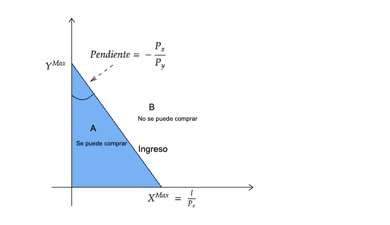

```{r meta, echo=FALSE}
library(metathis)
meta() %>%
  meta_general(
    description = "Método en Economía",
    generator = "xaringan and remark.js"
  ) %>% 
  meta_name("github-repo" = "keynes37/xaringan-rladies-xalapa") %>% 
  meta_social(
    title = "Métodos en Economía",
    url = "https://spcanelon.github.io/xaringan-rladies-xalapa",
    image = "https://github.com/spcanelon/xaringan-rladies-xalapa/blob/master/xaringan-rladies-xalapa-general.png",
    image_alt = "Diapositiva para introducción a la economía",
    og_type = "website",
    og_author = "Carlos Yanes",
    twitter_card_type = "summary_large_image",
    twitter_creator = "@keynes37"
  )
```

```{r configuracion, include = FALSE}
library(knitr)
library(tidyverse)
library(datos)
library(fontawesome)
library(emo)
library(xaringanExtra)
# set default options
opts_chunk$set(echo=FALSE,
               warning=FALSE,
               collapse = TRUE,
               dpi = 300)
knit_engines$set("yaml", "markdown")
xaringanExtra::use_tile_view()
xaringanExtra::use_clipboard()
xaringanExtra::use_share_again()
xaringanExtra::style_share_again(
  share_buttons = c("twitter", "linkedin", "pocket")
)
```

class: right, middle, inverse, titular
background-image: url(images/Un1.jpeg)
background-size: contain
background-position: -10cm 20%

<!---->

# `r rmarkdown::metadata$title` 
## **`r rmarkdown::metadata$subtitle`**
### `r rmarkdown::metadata$author`
### `r rmarkdown::metadata$date`

[`r fontawesome::fa("link")` Departamento de Economía](https://www.uninorte.edu.co/en/web/economia)

---
class: middle, inverse
.left-column[

# `r emo::ji("smile")`

]

.right-column[
# Preguntas de la sesión anterior?
]
---
class: middle, center
# El rol de los precios ... 📡
----

---
# Precios

--

Juegan un .hi-pink[rol] muy importante en las economías capitalistas.

--

* Provee un mecanismo para coordinar las .ul[necesidades] y buscar por ende la solución a estas.

--

* Ayuda a determinar la .hi-pink[interacción] entre consumidores (**demanda**) y productores (**oferta**) en los mercados.

--

**P.** Qué es el precio?

--

**R./** Un precio es un (ratio) en la cual dos bienes son intercambiados en un mercado

---
class: center, middle
# Una historia para contar.... 🤔

----

---
# Una historia...

--

`r fa("video", fill="red")` Guerra civil en los EEUU

--

+ Bloqueos en los puertos de los estados confederados

--

+ No llegó casi nada a Inglaterra de algodon que regularmente usan para producir textiles

--

#### Resultado:

--

`r fa("weight-hanging", fill="blue")` **Precios** del algodón (6) veces mas altos que antes del inicio de la guerra

--

`r fa("weight-hanging", fill="blue")` **Demanda** en la india *aumentó* 

--

`r fa("weight-hanging", fill="blue")` Se .ul[desarrollaron] nuevas maquinas de producción.

--

>> "such an extensive investment of capital that it amounted almost to the creation of a new industry". Douglas Farnie 


---
class: center, middle
# Método en economía

----

---
# Método en economía

--

Lo(a)s economistas tomamos en consideración lo siguiente:

--

`r fa("angle-double-right", fill="blue")` Primero observamos un **Fenómeno** de interés.

--

`r fa("angle-double-right", fill="blue")` Luego, basados en esas observaciones, dentro de la investigación enmarcamos lo que se denominan **hipótesis**, las cuales nos brindan una manera/forma de explicar un suceso.

--

`r fa("angle-double-right", fill="blue")` Después, construimos un modelo que nos permita *testear* la **hipótesis** de investigación.

--

`r fa("angle-double-right", fill="blue")` Finalmente, al ver que el modelo funcione podemos entonces enmarcar el diseño de las .hi-red[políticas públicas] para eso, también incluye todo lo concerniente al espacio estratégico de un ente privado si es el caso.

---
# Método en economía
--

### De lo anterior, nos lleva tambien a pensar en los ingredientes

--

+ Incentivos

--

+ Marginalidad

--

+ Costo de oportunidad

--

+ Intercambio (aquel que genera valor)

--

> Dentro de lo **económico** el método lleva a *optimizar* las decisiones de cada individuo dentro de la sociedad.

---
# Método en economía

--

### Observe el siguiente [video](http://vimeo.com/1665301)

--

1. Qué le llama la atención?

--

1. Considera que debe haber un mercado para todo?

--

1. Asigna correctamente el mercado el buen uso por los bienes?

---
# Método en economía

--

.pull-left[

]

--

.pull-right[
`r fa("sketch", fill="blue")` Las límitaciones de satisfacer .hi-red[necesidades] conlleva a la escasez.

`r fa("sketch", fill="blue")` La escasez genera .b[incentivos] para buscar la elección óptima

`r fa("sketch", fill="blue")` Las preguntas de .hi-slayer[elección] se convierten en los retos de satisfacer necesidades.
]


---
class: inverse
# Método en economía

--

## Ejemplo costo de oportunidad

--

> Asuma que usted desea viajar desde BAQ-BOG y puede hacerlo mediante dos **alternativas**, la primera ir en avión y demorarse dos horas en trayecto a un costo de 780 mil pesos el tiquete e irse por Bus intermunicipal a un precio de 180 mil pesos pero tardarse unas 22 horas de viaje. Cuál es el costo de oportunidad de esta persona?

--

**R./** Lo primero que debemos mirar es lo monetario.

--

$$\underbrace{780000}_{Avion}-\underbrace{180000}_{Bus}=600000$$
--

*Que sería lo que se ahorraría por irse en BUS*

--

Luego miramos las horas.

--

$$\underbrace{22}_{Bus}-\underbrace{2}_{Avion}=20$$

--

Lo que nos indica que el costo de oportunidad es $\frac{600\;mil}{20}=30\; \text{mil precio/hora}$

---
class: inverse
# Método en economía

Otra forma de verlo es:

--

> Elige ir $\Rightarrow$ en bus ya que es menos costoso que ir en avión
$$22\; \text{horas} + 180.000\;\leq 2\; \text{horas} + 780.000$$

--

> Restamos de ambos lados $180.000 y tenemos
$$22\; \text{horas} \;\leq 2\; \text{horas} + 600.000$$

--

> Restamos ahora de ambos lados 2 horas y vamos a ver que:
$$20\; \text{horas} \;\leq \; 600.000$$

--

> Dividimos entre 20 ambos lados para mirar lo siguiente:
$$1\; \text{hora} \;\leq \; 30.000$$

--

Si ve que llegamos a la misma respuesta de lo anterior!!. Indica desde luego que usted valora el tiempo en no mas que $30000.


---
class: inverse

# Método en economía

--

## Ahora.. hagalo usted mismo

--

> Supongamos que un estudiante universitario, Juan, tiene dos opciones para este fin de semana: ir a una fiesta con sus amigos o quedarse en casa para estudiar para un examen importante que tendrá la próxima semana. Si Juan decide ir a la fiesta, sacará 2 como nota en el examen y aparte se va a gastar $430.000. Si no asiste y se dedica a estudiar podrá sacar hasta 5 de nota y no va a gastar nada de dinero.

--

### Preguntas

--

`r fa("traffic-light", fill="red")` Cuál es el **costo de oportunidad** de ir a la fiesta?

--

`r fa("traffic-light", fill="yellow")` Digamos que si va a la fiesta y luego estudia podria llegar a sacar una nota de 3.0. Vale la pena el sacrificio? 

---
# Método en economía

--

### Respuesta

--

Debemos estar pendientes de analizar .hi-pink[todo]. Vamos a mirar las opciones:

--

> Elige $\Rightarrow$ estudiar, es menos costoso 
$$4\; \text{horas} + 5\;\leq 0\; \text{horas}+ 2 $$

--

> Restamos de ambos lados 2 y tenemos
$$4\; \text{horas} + 3 \;\leq 0\; \text{horas}$$

--

> Restamos ahora de ambos lados 0 horas y vamos a ver que:
$$4\; \text{horas} \;\leq \; -3$$

--

> Dividimos entre 4 ambos lados para mirar lo siguiente:
$$1\; \text{hora} \;\leq \; -0.75\; \text{puntos de nota}$$

--

**Juan**, no debe ir a la fiesta ya que una hora le cuesta mas de 0.75 puntos de nota en el examen.

---
# Método en economía

--

### Respuesta

--

Si va a la fiesta y saca 3.0. Cambia mucho la regla pero introduce la variable del costo de los $430.000 y desde luego se amplia el efecto. Desde luego nota y plata hace que la variable de las horas se desvanezca y desde luego haya que mirar el .hi[ratio] de 

--

$$5\; \text{nota} + 0\;\geq 3\; \text{nota}+ 430000 $$
--

$$2\; \text{nota} \;\geq \; 430000$$

--

$$1\; \text{nota} \;\geq \; 215000$$

--

Finalmente renunciar a 2 puntos en la nota final le cuesta mas de 215000 pesos yendo a la fiesta.


---
# Método en economía

--

### Flujo de la economía

--


---
# Método en economía


### Flujo de la economía


---
class: center, middle
# Bloque de preguntas

----

---
# Consumidor

--

## `r fontawesome::fa("ruler")` Responda lo siguiente:

.left-column[Dejaría alguien de fumar si le pagaran $850 mil en el mes por no hacerlo? ]

--

.right-column[ 
]

---
# Consumidor

--

## `r fontawesome::fa("ruler")` Responda lo siguiente:

.left-column[Cuanto está dispuesto a pagar? ]

--

.right-column[ 
]
---
# Consumidor

--

## `r fontawesome::fa("ruler")` Responda lo siguiente:

.left-column[Cuanto está dispuesto a pagar? ]

--

.right-column[ 
]
---
# Consumidor
--

`r fa("shopping-basket", fill = "red")` Por qué algunos estan dispuestos a pagar más?

--

`r fa("shopping-basket", fill = "red")` Por qué el **precio** no es el mismo para todos?

--

### El problema del (comprador/consumidor)

--

+ ¿Qué te gusta?
+ ¿Cuanto cuesta?
+ ¿Cuanto dinero tienes?

---
class: middle, center, inverse

# ¿Qué te gusta?

---
# Gustos y motivaciones

--

.pull-left[
`r fa("thumbs-up", fill = "red")` El **consumidor** quiere lo *máximo* siempre con el dinero que tiene.

`r fa("thumbs-up", fill = "red")` Lo que al final compramos, *revela* nuestros gustos y .hi-pink[Preferencias]

`r fa("wrench", fill = "red")` En **economía** las .ul[preferencias] se definen como $a \succ b$, que nos dice que .hi-red[a] es mejor que .hi-blue[b].  

]

.pull-right[

]

---
class: middle, center, inverse

# ¿Cuanto cuesta?

---
# ¿Cuanto cuesta?
--

.pull-left[
`r fa("thumbs-up", fill = "red")` Los **Precios** son fijos regularmente (no hay forma de regatear), por ende el **consumidor** es .ul[precio-aceptante].

`r fa("thumbs-up", fill = "red")` Podemos comprar todo lo que querramos de un .hi-pink[Bien] sin necesariamente hacer subir su precio.

`r fa("wrench", fill = "red")` En **economía** los .ul[precios] se definen como $P$ y se centran en la función matemática de $Q=f(p)$ que nos dice que .hi-red[Q] esta en función o (depende) de .hi-blue[P].  

]

.pull-right[

]

---
class: middle, center, inverse

# ¿Cuanto dinero tienes?

---
# ¿Cuanto dinero tienes?

.pull-left[
`r fa("thumbs-up", fill = "red")` No se puede pedir *Prestado* ni tampoco .ul[ahorrar], todo lo que puede hacer el **consumidor** es .ul[gastar].

`r fa("thumbs-up", fill = "red")` Regularmente nuestro presupuesto consta de los .hi-red[precios] de cada bien y desde luego el .hi-pink[ingreso directo].

`r fa("wrench", fill = "red")` En **economía** el .hi-blue[presupuesto] es representado por una .ul[linea] recta y se especifica como $I=P_x X+P_y Y$, donde $I$ es el *ingreso*, $(X)$ y $(Y)$ las **cantidades** que consume de cada bien el agente económico.  

]

.pull-right[

]

---
class: middle, inverse

# Presupuesto

---
# Presupuesto

--

.pull-left[

+ Mire lo siguiente:

| Combinación | Camisas | Pantalones |
| ----------- | ------- | ---------- |
| A           | 12      | 0          |
| B           | 8       | 2          |
| C           | 4       | 4          |
| D           | 0       | 6          |

]

--

.pull-right[]

--

> El **presupuesto** siempre va a decirnos la cantidad de dinero ($) que podemos gastar en BIENES. 

---
# Presupuesto

--

.pull-left[+ Nuestro presupuesto puede ayudarnos con:

$$P_y Y= I - P_x X$$
Despejando

$$Y= \underbrace{\frac{I}{P_y}}_{\text{Intercepto}}-\underbrace{\frac{P_xX}{P_y}}_{\text{Pendiente}}$$

Si hacemos a $(Y=0)$, podríamos resolver $(X)$ y por ende obtener su resultado:

$$\begin{aligned}
P_xX+P_yY =& I \\
P_xX+P_y(0) =& I \\
X=& \frac{I}{P_x}
\end{aligned}$$
]

.pull-right[]

---
# Bibliografía

`r fa('book')` Mankiw, N. G. (2005). *Principios de microeconomía* /N. Gregory Mankiw (No. 338.5 M55Y.).

`r fa('book')` Mateer, D., & Coppock, L. (2021). *Principles of Microeconomics.* WW Norton & Company.

`r fa('book')` Acemoglu, D., Laibson, D., & List, J. A. (2017). *Economía*. Antoni Bosch editor.

---
name: adios
class: middle, inverse

.pull-left[
# **¡Gracias!**
<br/>
## Método en economía

### Seguimos aprendiendo
]

.pull-right[
.right[


[`r fontawesome::fa("link")` Syllabus/ Curso](https://pomelo.uninorte.edu.co/pls/prod/bwckctlg.p_disp_course_detail?cat_term_in=202210&subj_code_in=ECO&crse_numb_in=0010)<br/>
[`r fontawesome::fa("twitter")` @keynes37](https://twitter.com/keynes37)<br/>
[`r fontawesome::fa("paper-plane")` cayanes@uninorte.edu.co](mailto:cayanes@uninorte.edu.co)
]
]

???
¡Gracias por tu atención! 
En este momento me encantaría tomar preguntas y si me quieren contactar no olviden enviar un email.


