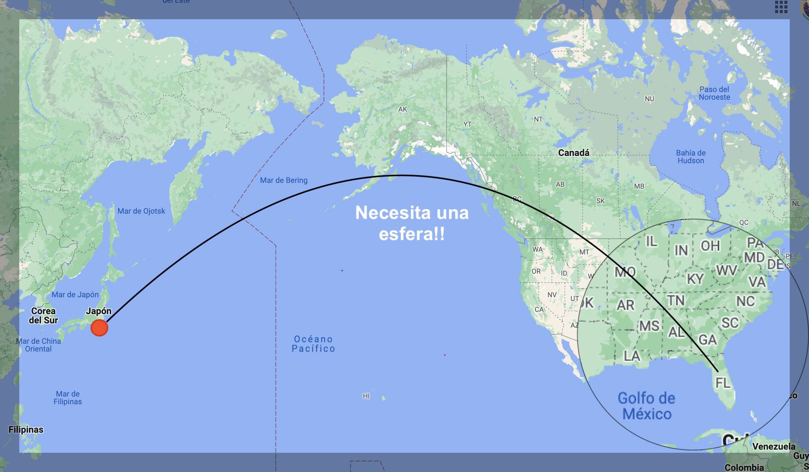
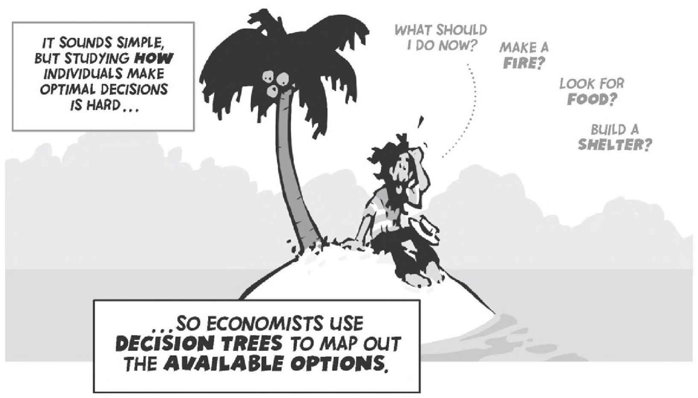
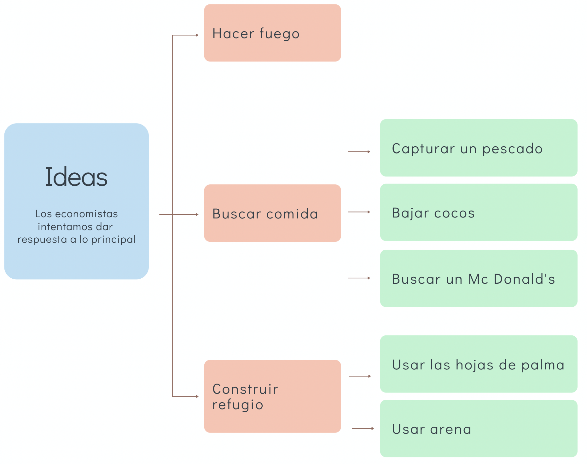

```{r meta, echo=FALSE}
library(metathis)
meta() %>%
  meta_general(
    description = "Problema económico",
    generator = "xaringan and remark.js"
  ) %>% 
  meta_name("github-repo" = "keynes37/xaringan-rladies-xalapa") %>% 
  meta_social(
    title = "Métodos en Economía",
    url = "https://spcanelon.github.io/xaringan-rladies-xalapa",
    image = "https://github.com/spcanelon/xaringan-rladies-xalapa/blob/master/xaringan-rladies-xalapa-general.png",
    image_alt = "Diapositiva para introducción a la economía",
    og_type = "website",
    og_author = "Carlos Yanes",
    twitter_card_type = "summary_large_image",
    twitter_creator = "@keynes37"
  )
```

```{r configuracion, include = FALSE}
library(knitr)
library(tidyverse)
library(datos)
library(fontawesome)
library(emo)
library(xaringanExtra)
# set default options
opts_chunk$set(echo=FALSE,
               warning=FALSE,
               collapse = TRUE,
               dpi = 300)
knit_engines$set("yaml", "markdown")
xaringanExtra::use_tile_view()
xaringanExtra::use_clipboard()
xaringanExtra::use_share_again()
xaringanExtra::style_share_again(
  share_buttons = c("twitter", "linkedin", "pocket")
)
```

class: right, middle, inverse, titular
background-image: url(images/Un1.jpeg)
background-size: contain
background-position: -10cm 20%

<!---->

# `r rmarkdown::metadata$title` 
## **`r rmarkdown::metadata$subtitle`**
### `r rmarkdown::metadata$author`
### `r rmarkdown::metadata$date`

[`r fontawesome::fa("link")` Departamento de Economía](https://www.uninorte.edu.co/en/web/economia)

---
class: middle, inverse
.left-column[

# `r emo::ji("smile")`

]

.right-column[
# Preguntas de la sesión anterior?
]

---
class: center, middle
# Sobre el uso de las matematicas en economía... 🫣

----

---
# Sobre el uso de las matematicas

--

`r fa("angle-double-right", fill="blue")` **Considere la siguiente expresión**:

--

<font size="+5">$$2+2=4$$</font>

--

<span style="font-size:larger;">Cualquiera puede hacerlo...</span>

--

`r fa("angle-double-right", fill="blue")` **Ahora mire a continuación**:

--

<font size="+5">$$2+2=\sqrt{16}$$</font>

--

<span style="font-size:larger;"> No todos pueden hacerlo...</span>

---
# Sobre el uso de las matematicas

--

`r fa("angle-double-right", fill="blue")` **Nuevamente mire a continuación**:

--

<font size="+5">$$3!-\left[1+\sum \limits_{p=1}^{\infty}\frac{1}{2^{p}}\right]=\sqrt{16}$$</font>

--

<span style="font-size:larger;"> Ahora si que pocos podrán hacerlo...</span>

---
# Sobre el uso de las matematicas

--

### Entonces

--

`r fa("angellist")` Conociendo de lo anterior ya usted tiene varias formas de obtener una .black[respuesta].

--

`r fa("angellist")` Aquellos **profesionales** que tengan en su cabeza un montón de herramientas de solución... ganarán mas que la mediana salarial.

--

`r fa("angellist")` Hay otras variables (redes sociales) y características (habilidades)... pero con las que contamos propiamente son **suficientes**.

--

`r fa("angellist")` En la medida que usted aprenda a **formalizar**, su grado de profesionalidad será mejor y podrá aspirar a cargos con mayor salario.

--

`r fa("angellist")` Formalizar lo lleva a ser mas **abstracto** y a tener una *señal de mercado* que lo(a) hace distinta al resto de personas que están en el mismo nivel laboral suyo.

---
class: center, middle
# Método científico (modelo y datos).... 😦

----

---
# Método científico

--

> **Modelo**: Una descripción simplificada de la realidad

--

## Pregunta

--
.pull-left[
### Es esto un avíon?
]

--

.pull-right[

]

---
# Método científico

--

### Cuál es la distacia mas corta entre dos puntos?

--



---
# Método científico

--

## Un modelo económico

--

Un ejemplo en base a .hi-red[evidencia]:

--

#### Rendimientos de la educación

--

`r fa("truck", fill="red")` Un .hi-blue[año] más de educación significa un aumento de los ingresos **futuros** en un 10%.

--

Si con 12 años de educación ganas $5000 la hora, con un año mas de educación (tu primer año de universidad) podrías ganar:

--

$$5000 \times 1,10= 5500 $$
---
# Método científico

## Un modelo económico

Un ejemplo en base a .hi-red[evidencia]:

#### Rendimientos de la educación

--

Si con 13 años de educación ganas $5500 la hora, con un año mas de educación (tu segundo año de universidad) podrías ganar:


--

$$5500 \times 1,10= 6050 $$

--

Tercer año: $6050 \times 1,10= 6655$

--

Cuarto año: $6655 \times 1,10= 7320$

---
# Método científico

--

`r fa("truck", fill="red")` .mono[Hipótesis:] obtener un grado universitario (13-16 años) hace aumentar el salario de .hi-red[5000] a .hi[6655], es decir, un 33%.

--

$$\text{Tasa de variación}: \frac{(X_2-X_1)}{X_1}\times 100\%= \frac{6655-5000}{5000}\times 100\%= 33,09\%$$
--

### Características

--

+ Los .slate[modelos] no son .ul[exactos]. No todo el mundo ganará un (10%) por cada año adicional a su educación.

--

+ Generan predicciones que se pueden poner a prueba con .ul[datos].


---
# Método científico

--

```{R, graph1, echo = F, fig.height = 5, fig.width = 9, dev = "svg"}
# Datos
pop_df = 
  data.frame(
  lang = c("Graduados Bachillerato", "Graduados Universitarios"),
  n_jobs = c(975000, 1300000),
  free = c(F, T)
  )
## Graficando
pop_df %>% 
  mutate(lang = lang %>% factor(ordered = T)) %>%
  ggplot(aes(x = lang, y = n_jobs, fill = free)) +
  geom_col() +
  geom_hline(yintercept = 0) +
  aes(x = reorder(lang, -n_jobs), fill = reorder(free, -free)) +
  xlab("Personas") +
  scale_y_continuous(label = scales::comma) +
  ylab("Salario que ganan en $ cop ") +
  labs(
    title = "Ingresos anuales por trabajo",
    subtitle = "Ingresos promedio, co.Talent.com 2023"
    ) +
  scale_fill_manual(
    "Son mas formales",
    labels = c("Si", "No"),
    values = c("#f92672", "darkslategray")
    ) +
  ggthemes::theme_pander(base_size = 17) +
  # theme_ipsum() +
  theme(legend.position = "bottom")
```

---
# Método científico

--

`r fa("wallet", fill="red")` Entonces.. ¿ Cuál es la relación entre el salario de un bachiller y el de un .hi-slate[universitario]?

--

+ .hi-slate[Universitario] 1'300.000

--

+ Bachiller 975.000

--

El grado .hi-turquoise[universitario] proporciona un salario un 33% mas alto.

--

$$\frac{1300000}{975000}= 1.33$$
--

El .red[modelo] predecía un 33%.

--

### ¿Te parece suficientemente acertado?

---
class: center, middle, inverse
# Si un graduado gana $1'300.000/mes, ¿significa que todos los graduados ganan lo mismo?

---
# Método científico

--

.pull-left[Qué pasó con Bill Gates...]

.pull-right[

]


---
class: center, middle

# Problema económico 😲

----

---
# Problema económico

--



Fuente: The cartoon introduction to economics. Chapter 2

---
# Problema económico

--

Se resume en:

--

## Qué producir?

--

## Cómo producir?

--

## Para quién producir?

---
# Problema económico

--



---
# Problema económico

--

### Recuerde que... 🥴 cualquier decisión genera.. un sacrificio

--

> El enfoque .black[marginalista] permite mirar ese tipo de análisis y enfoca mucho de lo que se aprende en economía.

--

`r fa("swift", fill="red")` .slate[Frontera de posibilidad de producción] (FPP)  permite mirar  

---
# Problema económico

--

```{r datos1, include=FALSE}
library(DiagrammeR)
library(hrbrthemes)
library(econocharts)
library(plotly)
p <- ppf(x = 4:6, # Intersections
         main = "Frontera de posibilidad de Producción",
         geom = "text",
         generic = TRUE, # Generic labels
         labels = c("A", "B", "C"), # Custom labels
         xlab = "Motos",
         ylab = "Carros",
         acol = 3)      # Color of the area
```

```{r, exam1, echo=FALSE, fig.height=3}
p$p + geom_point(data = data.frame(x = 5, y = 5), size = 5) +
  geom_point(data = data.frame(x = 2, y = 2), size = 5) +
  annotate("segment", x = 3.1, xend = 4.25, y = 5, yend = 5,
           arrow = arrow(length = unit(0.5, "lines")), colour = 3, lwd = 1) +
  annotate("segment", x = 4.25, xend = 4.25, y = 5, yend = 4,
           arrow = arrow(length = unit(0.5, "lines")), colour = 3, lwd = 1)
```

---
# Problema económico

--

.pull-left[
`r fa("tag", fill="red")` Observe lo siguiente:

+ Los .red[bienes] son aquellos que satisfacen las necesidades de las personas. Adquirirlos tiene un .black[precio].

+ La .slate[demanda] surge de la interacción de lo que se consume con lo que cuesta/vale (precio) de ese bien.

+ *Matemáticamente es:*

| Precio | Demanda |
|--------|---------|
| $ 8    | 1       |
| $ 5    | 3       |
| $ 2.5  | 6       |
| $ 1.5  | 9       |

+ Note que en la medida que el precio (.red[disminuye]) las cantidades aumentan


]

.pull-right[
```{r, demand1, echo=FALSE, message=FALSE, fig.height=6}
demand(main = "Demanda", # Title
       sub = "Función con el precio",   # Subtitle
       xlab = "Cantidades",      # X-axis label
       ylab = "Precio",      # Y-axis label
       names = "D[1]",  # Custom name for the curve
       geomcol = 3)     # Color of the custom name of the curve
```
]

---
# Problema económico

--

.pull-left[- En algunos momentos tendremos *desplazamiento* a lo largo de la **curva de la demanda**.


- Esos .red[casos] ocurren cuando la variable .black[precio] 💰 cambia.]

--

.pull-right[

```{r, demand2, echo=FALSE, fig.height=6}
demand(ncurves = 1,            
       type = "convex",        
       x = c(8, 5, 3),         
       linecol = 4,            
       generic = TRUE,         
       geom = "label",        
       geomfill = "lightblue",
       main = "Curva de demanda")
```

]

---
# Problema económico

--

.pull-left[

- En otros momentos tendremos *desplazamiento* hacia $(\uparrow)$ o hacia $(\downarrow)$ en el mapa de curvas.


- Esos .red[casos] ocurren cuando otra variable distinta al .black[precio] 💰 influye en el mercado.

- Este tipo de variables pueden ser *coyunturales* p.e: Una plaga, una moda, un incremento de las migraciones, etc.

- Las contracciones generan un desplazamiento a la .ul[izquierda] de la demanda original.

- Las expansiones en cambio generan desplazamientos a la .pink[derecha] de la demanda original]

--

.pull-right[

```{r, demand3, echo=FALSE, fig.height=6}
p <- indifference(ncurves = 2, x = c(2, 4), linecol = 3, main = "Desplazamiento demanda", xlab = "Cantidad X", ylab = "Precio")

int <- bind_rows(curve_intersect(data.frame(x = 1:1000, y = rep(3, nrow(p$curve))), p$curve + 1))

p$p + geom_segment(data = int, aes(x = 0, y = y, xend = x, yend = y), lty = "dotted")  +
      geom_segment(data = int, aes(x = x, y = 0, xend = x, yend = y), lty = "dotted") +
      geom_point(data = int, size = 3)
```

]

---
# Problema económico

--

.pull-left[
| Precio | Oferta |
|--------|---------|
| $ 8    | 11       |
| $ 5    | 7.5     |
| $ 2.5  | 6       |
| $ 1.5  | 1.4       |

- Note que en la medida que el precio (.red[aumenta]) las cantidades *ofrecidas* aumentan.

- La oferta (son las empresas) ellas desean un precio .black[mejor].

- Habrá mas oferta en la medida que los precios son .black[mayores].]

--

.pull-right[
```{r, Supply1, echo=FALSE, message=FALSE, fig.height=6}
supply(main = "Oferta", # Title
       sub = "Función con el precio",   # Subtitle
       xlab = "Cantidades",      # X-axis label
       ylab = "Precio",      # Y-axis label
       names = "S[1]",  # Custom name for the curve
       geomcol = 1)     # Color of the custom name of the curve
```
]

---
class: center, middle

# Oferta y Demanda


---
# Oferta y Demanda

--

.pull-left[
`r fa("shopping-cart", fill="red")` Los **mercados** deben tender a un .hi-slate[equilibrio]. Si este no esta presente, lo mas probable es que se presenten desajustes con los precios y alguno de los individuos que en el interactuan saldrá "perjudicado".
]
--
.pull-right[
```{r fig.height=4, mark1, echo=FALSE}
# datos
supply1 <- data.frame(x = c(2, 7), y = c(2, 7))
demand1 <- data.frame(x = c(7, 2), y = c(2, 7))

p <- sdcurve(supply1,   # Custom data
             demand1,
             equilibrium = TRUE)
p
```
]
---
# Oferta y Demanda

--

`r fa("star", fill="blue")` El .red[poder de mercado] permite que posiblemente se presenten distintas interacciones, distintas pendientes e incluso algunos desajustes del mercado.

--

`r fa("star", fill="blue")` Algunas .black[políticas públicas] pueden interferir y crear que se den equilibrios deseados dentro del mercado. sin embargo en algún punto y con libertad estos se darán en el punto de equilibrio.

--

> El equilibrio vacia el mercado. No permite que exista sobreproducción ni tampoco sobrecalentamiento de la demanda.


---
# Bibliografía

`r fa('book')` Mankiw, N. G. (2005). *Principios de microeconomía* /N. Gregory Mankiw (No. 338.5 M55Y.).

`r fa('book')` Mateer, D., & Coppock, L. (2021). *Principles of Microeconomics.* WW Norton & Company.

`r fa('book')` Acemoglu, D., Laibson, D., & List, J. A. (2017). *Economía*. Antoni Bosch editor.

`r fa('book')` Bauman, Y. (2010). *The Cartoon Introduction to Economics, Volume I: Microeconomics*. Hill and Wang.

---
name: adios
class: middle, inverse

.pull-left[
# **¡Gracias!**
<br/>
## Problema económico

### Seguimos aprendiendo
]

.pull-right[
.right[


[`r fontawesome::fa("link")` Syllabus/ Curso](https://pomelo.uninorte.edu.co/pls/prod/bwckctlg.p_disp_course_detail?cat_term_in=202210&subj_code_in=ECO&crse_numb_in=0010)<br/>
[`r fontawesome::fa("twitter")` @keynes37](https://twitter.com/keynes37)<br/>
[`r fontawesome::fa("paper-plane")` cayanes@uninorte.edu.co](mailto:cayanes@uninorte.edu.co)
]
]

???
¡Gracias por tu atención! 
En este momento me encantaría tomar preguntas y si me quieren contactar no olviden enviar un email.

