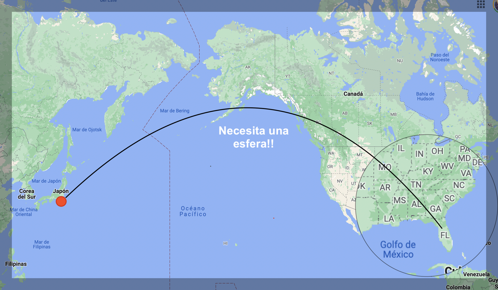
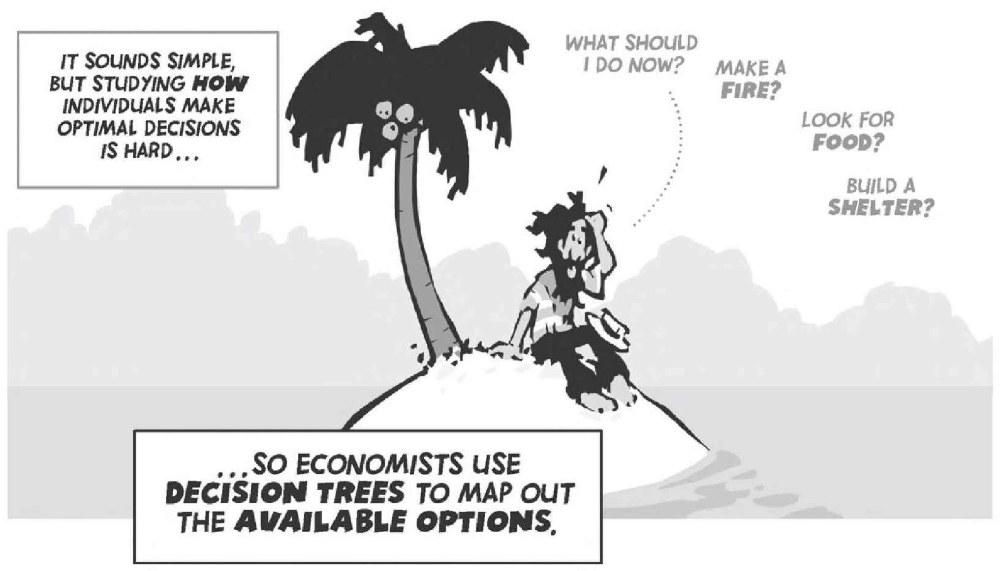

```{r configuracion, include = FALSE}
library(knitr)
library(tidyverse)
library(datos)
library(fontawesome)
library(emo)
library(xaringanExtra)
# set default options
opts_chunk$set(echo=FALSE,
               warning=FALSE,
               collapse = TRUE,
               dpi = 300)
knit_engines$set("yaml", "markdown")
xaringanExtra::use_tile_view()
xaringanExtra::use_clipboard()
xaringanExtra::use_share_again()
xaringanExtra::style_share_again(
  share_buttons = c("twitter", "linkedin", "pocket")
)

## Adicional

library(ggplot2)

purple   <- "#6A3D9A"
red_pink <- "#E83E8C"
met_slate <- "#2F4858"

supply <- function(q) q
demand <- function(q) 10 - q

theme_market <- theme_classic(base_size = 18) +
  theme(
    axis.title = element_text(face = "bold"),
    axis.text = element_text(color = "black"),
    plot.background = element_rect(fill = "white", color = NA),
    panel.background = element_rect(fill = "white", color = NA)
  )

market <- ggplot(data = data.frame(x = 0), aes(x = x)) +
  scale_x_continuous(
    limits = c(0, 10.5),
    expand = c(0, 0),
    breaks = seq(0, 10, 1)
  ) +
  scale_y_continuous(
    limits = c(0, 10.5),
    expand = c(0, 0),
    breaks = seq(0, 10, 1)
  ) +
  theme_market +
  labs(x = "Q", y = "P") +
  stat_function(fun = supply, color = purple, size = 1.2) +
  stat_function(fun = demand, color = red_pink, size = 1.2) +
  annotate("text", label = "O", x = 10, y = 9.5, color = purple, size = 8) +
  annotate("text", label = "D", x = 10, y = 0.7, color = red_pink, size = 8)

```

class: right, middle, inverse, titular
background-image: url(images/Un1.jpeg)
background-size: contain
background-position: -10cm 20%

<!---->

# `r rmarkdown::metadata$title` 
## **`r rmarkdown::metadata$subtitle`**
### `r rmarkdown::metadata$author`
### `r rmarkdown::metadata$date`

[`r fontawesome::fa("link")` Departamento de Economía](https://www.uninorte.edu.co/en/web/economia)

---
class: middle, inverse
.left-column[

# `r emo::ji("smile")`

]

.right-column[
# Preguntas de la sesión anterior?
]

---
class: center, middle
# Sobre el uso de las matematicas en economía... 🫣

----

---
# Sobre el uso de las matematicas

--

`r fa("angle-double-right", fill="blue")` **Considere la siguiente expresión**:

--

<font size="+5">$$2+2=4$$</font>

--

<span style="font-size:larger;">Cualquiera puede hacerlo...</span>

--

`r fa("angle-double-right", fill="blue")` **Ahora mire a continuación**:

--

<font size="+5">$$2+2=\sqrt{16}$$</font>

--

<span style="font-size:larger;"> No todos pueden hacerlo...</span>

---
# Sobre el uso de las matematicas

--

`r fa("angle-double-right", fill="blue")` **Nuevamente mire a continuación**:

--

<font size="+5">$$3!-\left[1+\sum \limits_{p=1}^{\infty}\frac{1}{2^{p}}\right]=\sqrt{16}$$</font>

--

<span style="font-size:larger;"> Ahora si que pocos podrán hacerlo...</span>

---
# Sobre el uso de las matematicas

--

### Entonces

--

`r fa("angellist")` Conociendo de lo anterior ya usted tiene varias formas de obtener una .black[respuesta].

--

`r fa("angellist")` Aquellos **profesionales** que tengan en su cabeza un montón de herramientas de solución... ganarán mas que la mediana salarial.

--

`r fa("angellist")` Hay otras variables (redes sociales) y características (habilidades)... pero con las que contamos propiamente son **suficientes**.

--

`r fa("angellist")` En la medida que usted aprenda a **formalizar**, su grado de profesionalidad será mejor y podrá aspirar a cargos con mayor salario.

--

`r fa("angellist")` Formalizar lo lleva a ser mas **abstracto** y a tener una *señal de mercado* que lo(a) hace distinta al resto de personas que están en el mismo nivel laboral suyo.

---
class: center, middle
# Método científico (modelo y datos).... 😦

----

---
# Método científico

--

> **Modelo**: Una descripción simplificada de la realidad

--

## Pregunta

--
.pull-left[
### Es esto un avíon?
]

--

.pull-right[

]

---
# Método científico

--

### Cuál es la distacia mas corta entre dos puntos?

--



---
# Método científico

--

## Un modelo económico

--

Un ejemplo en base a .hi-red[evidencia]:

--

#### Rendimientos de la educación

--

`r fa("truck", fill="red")` Un .hi-blue[año] más de educación significa un aumento de los ingresos **futuros** en un 10%.

--

Si con 12 años de educación ganas $5000 la hora, con un año mas de educación (tu primer año de universidad) podrías ganar:

--

$$5000 \times 1,10= 5500 $$
---
# Método científico

## Un modelo económico

Un ejemplo en base a .hi-red[evidencia]:

#### Rendimientos de la educación

--

Si con 13 años de educación ganas $5500 la hora, con un año mas de educación (tu segundo año de universidad) podrías ganar:


--

$$5500 \times 1,10= 6050 $$

--

Tercer año: $6050 \times 1,10= 6655$

--

Cuarto año: $6655 \times 1,10= 7320$

---
# Método científico

--

`r fa("truck", fill="red")` .mono[Hipótesis:] obtener un grado universitario (13-16 años) hace aumentar el salario de .hi-red[5000] a .hi[6655], es decir, un 33%.

--

$$\text{Tasa de variación}: \frac{(X_2-X_1)}{X_1}\times 100\%= \frac{6655-5000}{5000}\times 100\%= 33,09\%$$
--

### Características

--

+ Los .slate[modelos] no son .ul[exactos]. No todo el mundo ganará un (10%) por cada año adicional a su educación.

--

+ Generan predicciones que se pueden poner a prueba con .ul[datos].


---
# Método científico

--

```{R, graph1, echo = F, fig.height = 5, fig.width = 9, dev = "svg"}
# Datos
pop_df = 
  data.frame(
  lang = c("Graduados Bachillerato", "Graduados Universitarios"),
  n_jobs = c(975000, 1300000),
  free = c(F, T)
  )
## Graficando
pop_df %>% 
  mutate(lang = lang %>% factor(ordered = T)) %>%
  ggplot(aes(x = lang, y = n_jobs, fill = free)) +
  geom_col() +
  geom_hline(yintercept = 0) +
  aes(x = reorder(lang, -n_jobs), fill = reorder(free, -free)) +
  xlab("Personas") +
  scale_y_continuous(label = scales::comma) +
  ylab("Salario que ganan en $ cop ") +
  labs(
    title = "Ingresos anuales por trabajo",
    subtitle = "Ingresos promedio, co.Talent.com 2023"
    ) +
  scale_fill_manual(
    "Son mas formales",
    labels = c("Si", "No"),
    values = c("#f92672", "darkslategray")
    ) +
  ggthemes::theme_pander(base_size = 17) +
  # theme_ipsum() +
  theme(legend.position = "bottom")
```

---
# Método científico

--

`r fa("wallet", fill="red")` Entonces.. ¿ Cuál es la relación entre el salario de un bachiller y el de un .hi-slate[universitario]?

--

+ .hi-slate[Universitario] 1'300.000

--

+ Bachiller 975.000

--

El grado .hi-turquoise[universitario] proporciona un salario un 33% mas alto.

--

$$\frac{1300000}{975000}= 1.33$$
--

El .red[modelo] predecía un 33%.

--

### ¿Te parece suficientemente acertado?

---
class: center, middle, inverse
# Si un graduado gana $1'300.000/mes, ¿significa que todos los graduados ganan lo mismo?

---
# Método científico

--

.pull-left[Qué pasó con Bill Gates...]

.pull-right[

]


---
class: center, middle

# Problema económico 😲

----

---
# Problema económico

--



Fuente: The cartoon introduction to economics. Chapter 2

---
# Problema económico

--

Se resume en:

--

## Qué producir?

--

## Cómo producir?

--

## Para quién producir?

---
class: center, middle, inverse

# Demanda y oferta 🌿

---
# Demanda y oferta

--

.pull-left[

```{r demanda-oferta-base, echo=FALSE, fig.height=5, fig.width=5, dev="svg"}
market
```
]

--

.pull-right[
`r fa("bell", fill="red")` La .hi-pink[demanda] muestra cuánto quieren comprar los consumidores.

`r fa("bell", fill="blue")` La .hi-blue[oferta] muestra cuánto quieren vender los productores.

`r fa("bell", fill="purple")` El precio coordina ambas decisiones.
]
---
# Demanda y oferta

.pull-left[

```{r demanda-oferta-base-1.2, echo=FALSE, fig.height=5, fig.width=5, dev="svg"}
market + geom_point(aes(x = 5, y = 5), color = met_slate, size = 3) +
  geom_segment(aes(x = 5, y = 0, xend = 5, yend = 5),
               linetype = "dashed", color = met_slate, size = 1) +
  geom_segment(aes(x = 0, y = 5, xend = 5, yend = 5),
               linetype = "dashed", color = met_slate, size = 1)
```
]

--

.pull-right[
`r fa("check-circle", fill="green")` La oferta y la demanda se igualan.

$$Q_d = Q_s$$

`r fa("shopping-basket", fill="red")` En este ejemplo:

$$Q^* = 5, \quad P^* = 5$$

El mercado está en .hi-pink[equilibrio].
]

---
# Demanda y oferta

.pull-left[
```{r demanda-oferta-base-1.3, echo=FALSE, fig.height=5, fig.width=5, dev="svg"}

market + geom_hline(yintercept = 3, linetype = "dashed", color = met_slate, size = 1) + geom_segment(aes(x = 3, y = 0, xend = 3, yend = 3), linetype = "dashed", color = met_slate, size = 1) + geom_segment(aes(x = 7, y = 0, xend = 7, yend = 3), linetype = "dashed", color = met_slate, size = 1) + geom_point(aes(x = 3, y = 3), color = met_slate, size = 3) + geom_point(aes(x = 7, y = 3), color = met_slate, size = 3) + annotate("segment", x = 3, xend = 7, y = 3.4, yend = 3.4, arrow = arrow(ends = "both", length = unit(0.2, "cm")), color = "red", size = 1) + annotate("text", x = 5, y = 4, label = "Escasez", color = "red", size = 6)
```

]

--

.pull-right[
`r fontawesome::fa("exclamation-circle", fill = "blue")` Si el precio está por debajo del equilibrio:

$$P < P^*$$

`r fa("arrow-down", fill="red")` La cantidad demandada es mayor que la ofrecida.

$$Q_d > Q_s$$

Hay .hi-pink[escasez].
]

---
# Demanda y oferta

.pull-left[
```{r excedente, echo=FALSE, fig.height=5, fig.width=5, dev="svg"}
market + geom_hline(yintercept = 7, linetype = "dashed", color = met_slate, size = 1) + geom_segment(aes(x = 3, y = 0, xend = 3, yend = 7), linetype = "dashed", color = met_slate, size = 1) + geom_segment(aes(x = 7, y = 0, xend = 7, yend = 7), linetype = "dashed", color = met_slate, size = 1) +
  geom_point(aes(x = 3, y = 7), color = met_slate, size = 3) +
  geom_point(aes(x = 7, y = 7), color = met_slate, size = 3) +
  annotate("segment", x = 3, xend = 7, y = 7.4, yend = 7.4, arrow = arrow(ends = "both", length = unit(0.2, "cm")),
           color = "blue", size = 1) +
  annotate("text", x = 5, y = 8, label = "Exceso de oferta", color = "blue", size = 6)
```
]

--

.pull-right[
`r fontawesome::fa("exclamation-circle", fill = "blue")` Si el precio está por encima del equilibrio:

$$P > P^*$$

`r fa("arrow-up", fill="blue")` La cantidad ofrecida es mayor que la demandada.

$$Q_s > Q_d$$

Hay .hi-blue[exceso de oferta].
]

---
class: middle

# Pregunta:
----

--

## Describa una situación de la vida diaria en la que aumente la demanda de un producto. ¿Qué pudo haber causado ese cambio?

---
class: inverse, middle

# Desplazamientos de la curva 🛎️

---
# Desplazamiento de la Demanda

--

.pull-left[
```{r demanda-normal, echo=FALSE, fig.height=5, fig.width=5, dev="svg"}
demanda <- function(q) 10 - q

ggplot(data = data.frame(x = 0), aes(x = x)) + scale_x_continuous(limits = c(0, 12), expand = c(0, 0), breaks = seq(0, 12, 1)) + scale_y_continuous(limits = c(0, 12), expand = c(0, 0), breaks = seq(0, 12, 1)) + theme_market + labs(x = "Q", y = "P") + stat_function(fun = demanda, color = red_pink, size = 1.2) + annotate("text", label = "D", x = 9.8, y = 0.7, color = red_pink, size = 8)
```
]

.pull-right[

`r fontawesome::fa("chart-line")` Esta es una curva de demanda normal.

`r fontawesome::fa("arrow-down")` Tiene pendiente negativa.

`r fontawesome::fa("shopping-cart")` A mayor precio, menor cantidad demandada.
]

---
# Desplazamiento de la Demanda

.pull-left[
```{r demanda-normal-des, echo=FALSE, fig.height=5, fig.width=5, dev="svg"}
demanda <- function(q) 10 - q
demanda_nueva <- function(q) 12 - q

ggplot(data = data.frame(x = 0), aes(x = x)) +
  scale_x_continuous(limits = c(0, 12), expand = c(0, 0),
                     breaks = seq(0, 12, 1)) +
  scale_y_continuous(limits = c(0, 12), expand = c(0, 0),
                     breaks = seq(0, 12, 1)) +
  theme_market +
  labs(x = "Q", y = "P") +
  stat_function(fun = demanda, color = red_pink, size = 1.1) +
  stat_function(fun = demanda_nueva, color = "blue", size = 1.2) +
  annotate("text", label = "D", x = 9.8, y = 0.7,
           color = red_pink, size = 8) +
  annotate("text", label = "D'", x = 11.2, y = 1.1,
           color = "blue", size = 8) +
  annotate("segment", x = 4, xend = 6, y = 6, yend = 6,
           arrow = arrow(length = unit(0.25, "cm")),
           color = "black", size = 1)
```
]

.pull-right[
`r fontawesome::fa("arrow-right")` La demanda se desplaza hacia la derecha.

`r fontawesome::fa("plus-circle")` Esto significa que aumenta la demanda.

`r fontawesome::fa("info-circle")` A cada precio, los consumidores quieren comprar más.
]

---
# Desplazamiento de la Demanda

--

Los .pink[desplazamientos] ocurren sobre todo cuando una variable diferente al **PRECIO**, cambia o genera un cambio en el consumo o demanda de un bien. 

--

### Ingresos

--

En Algunas ocasiones, cuando el **INGRESO** cambia $\uparrow$ o $\downarrow$ puede generar cambios circunstanciales sobre la demanda de los bienes.

--

### Gustos

--

Los  **GUSTOS** tambien inciden en la demanda, ya que puede $\uparrow$ o $\downarrow$ y de esta manera tambien el nivel general de los precios.

--

### Expectativas

--

> Si las personas esperan que el precio suba en el futuro, compran más hoy → la demanda actual aumenta.


---
class: middle, inverse

# Qué ocurre con la oferta? 🙂

---
# Desplazamiento de la oferta

--

.pull-left[
```{r oferta-normal, echo=FALSE, fig.height=5, fig.width=5, dev="svg"}
oferta <- function(q) q

ggplot(data = data.frame(x = 0), aes(x = x)) +
  scale_x_continuous(limits = c(0, 12), expand = c(0, 0),
                     breaks = seq(0, 12, 1)) +
  scale_y_continuous(limits = c(0, 12), expand = c(0, 0),
                     breaks = seq(0, 12, 1)) +
  theme_market +
  labs(x = "Q", y = "P") +
  stat_function(fun = oferta, color = purple, size = 1.2) +
  annotate("text", label = "O", x = 10.5, y = 10.5,
           color = purple, size = 8)
```
]

.pull-right[
`r fontawesome::fa("chart-line")` Esta es una curva de oferta normal.

`r fontawesome::fa("arrow-up")`Tiene pendiente positiva.

`r fontawesome::fa("industry")` A mayor precio, mayor cantidad ofrecida.
]

---
# Desplazamiento de la oferta

.pull-left[
```{r oferta-normal2, echo=FALSE, fig.height=5, fig.width=5, dev="svg"}
oferta <- function(q) q
oferta_nueva <- function(q) q - 2

ggplot(data = data.frame(x = 0), aes(x = x)) +
  scale_x_continuous(limits = c(0, 12), expand = c(0, 0),
                     breaks = seq(0, 12, 1)) +
  scale_y_continuous(limits = c(0, 12), expand = c(0, 0),
                     breaks = seq(0, 12, 1)) +
  theme_market +
  labs(x = "Q", y = "P") +
  stat_function(fun = oferta, color = purple, size = 1.1) +
  stat_function(fun = oferta_nueva, color = "blue", size = 1.2) +
  annotate("text", label = "O", x = 10.2, y = 10.2,
           color = purple, size = 8) +
  annotate("text", label = "O'", x = 11.2, y = 9.2,
           color = "blue", size = 8) +
  annotate("segment", x = 5, xend = 7, y = 5, yend = 5,
           arrow = arrow(length = unit(0.25, "cm")),
           color = "black", size = 1)
```
]

--

.pull-right[
`r fontawesome::fa("arrow-right")` La oferta se desplaza hacia la derecha.

`r fontawesome::fa("plus-circle")` Esto significa que aumenta la oferta.

`r fontawesome::fa("info-circle")` A cada precio, los productores quieren vender más.
]
---
# Desplazamiento de la oferta

--

Los .pink[desplazamientos] ocurren sobre todo cuando una variable diferente al **PRECIO**, cambia o genera un cambio en la producción u oferta de un bien.

--

### Costos de producción

--

En algunas ocasiones, cuando los **COSTOS DE PRODUCCIÓN** cambian $\uparrow$ o $\downarrow$, pueden generar cambios importantes sobre la oferta de los bienes.

--

### Tecnología

--

La **TECNOLOGÍA** también incide en la oferta, ya que puede permitir producir más con los mismos recursos y desplazar la oferta hacia la derecha.

--

### Expectativas

--

> Si las empresas esperan que el precio suba en el futuro, pueden ofrecer menos hoy para vender después → la oferta actual disminuye.


---
# Bibliografía

`r fa('book')` Mankiw, N. G. (2005). *Principios de microeconomía* /N. Gregory Mankiw (No. 338.5 M55Y.).

`r fa('book')` Mateer, D., & Coppock, L. (2021). *Principles of Microeconomics.* WW Norton & Company.

`r fa('book')` Acemoglu, D., Laibson, D., & List, J. A. (2017). *Economía*. Antoni Bosch editor.

`r fa('book')` Bauman, Y. (2010). *The Cartoon Introduction to Economics, Volume I: Microeconomics*. Hill and Wang.

---
name: adios
class: middle, inverse

.pull-left[
# **¡Gracias!**
<br/>
## Problema económico

### Seguimos aprendiendo
]

.pull-right[
.right[


[`r fontawesome::fa("link")` Syllabus/ Curso](https://pomelo.uninorte.edu.co/pls/prod/bwckctlg.p_disp_course_detail?cat_term_in=202210&subj_code_in=ECO&crse_numb_in=0010)<br/>
[`r fontawesome::fa("twitter")` @keynes37](https://twitter.com/keynes37)<br/>
[`r fontawesome::fa("paper-plane")` cayanes@uninorte.edu.co](mailto:cayanes@uninorte.edu.co)
]
]

???
¡Gracias por tu atención! 
En este momento me encantaría tomar preguntas y si me quieren contactar no olviden enviar un email.

