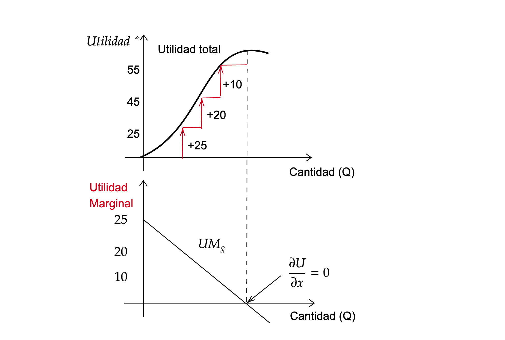
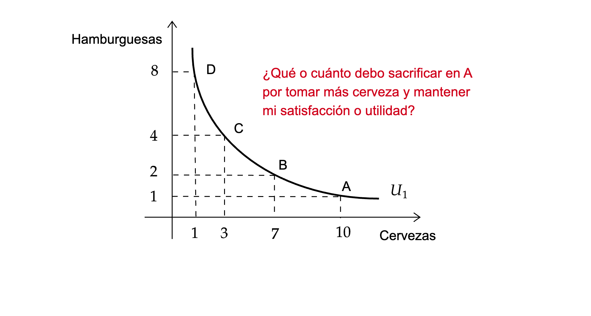
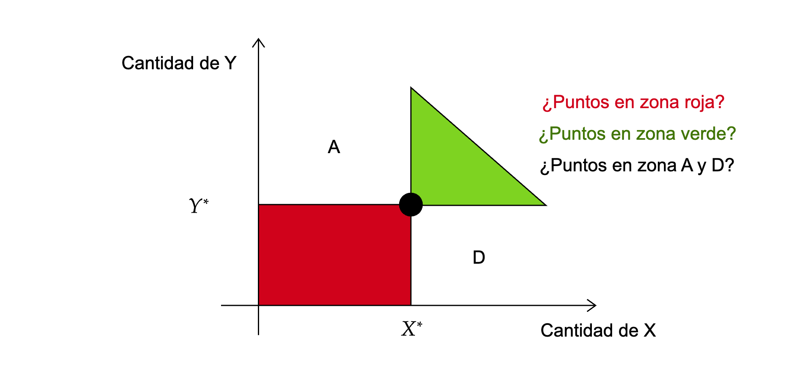
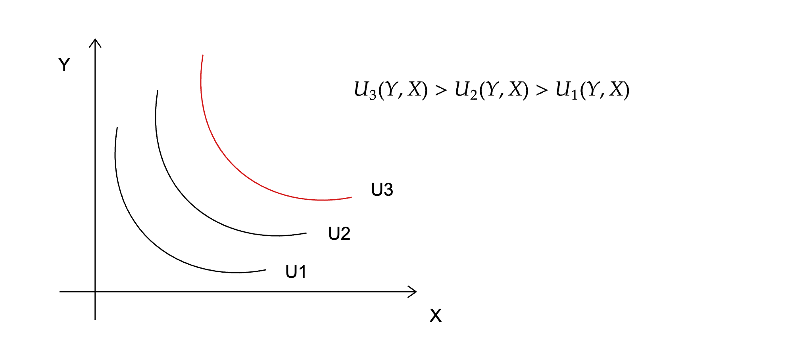
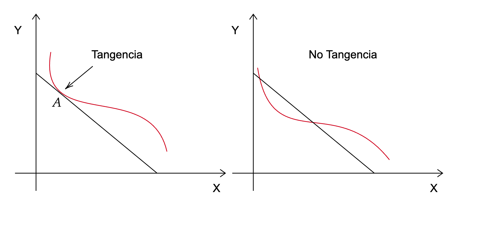
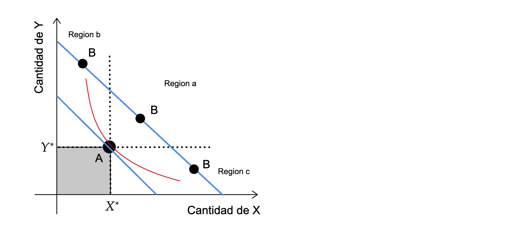
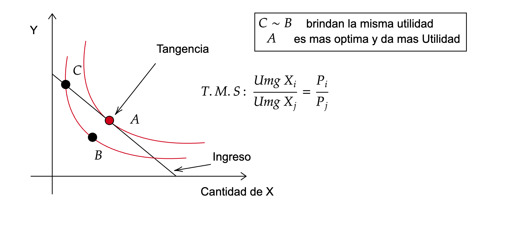
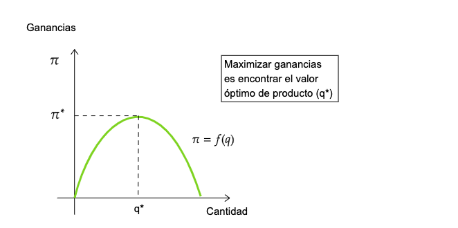
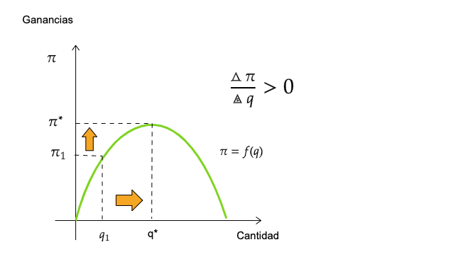
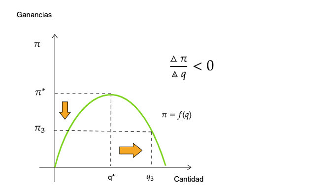

```{r meta, echo=FALSE}
library(metathis)
meta() %>%
  meta_general(
    description = "Problema económico",
    generator = "xaringan and remark.js"
  ) %>% 
  meta_name("github-repo" = "keynes37/xaringan-rladies-xalapa") %>% 
  meta_social(
    title = "Métodos en Economía",
    url = "https://spcanelon.github.io/xaringan-rladies-xalapa",
    image = "https://github.com/spcanelon/xaringan-rladies-xalapa/blob/master/xaringan-rladies-xalapa-general.png",
    image_alt = "Diapositiva para introducción a la economía",
    og_type = "website",
    og_author = "Carlos Yanes",
    twitter_card_type = "summary_large_image",
    twitter_creator = "@keynes37"
  )
```

```{r configuracion, include = FALSE}
library(knitr)
library(tidyverse)
library(datos)
library(fontawesome)
library(emo)
library(xaringanExtra)
# set default options
opts_chunk$set(comment = "#>",
               echo=FALSE,
               collapse = TRUE,
               dpi = 300)
#knit_engines$set("yaml", "markdown")
#xaringanExtra::use_tile_view()
#xaringanExtra::use_clipboard()
#xaringanExtra::use_share_again()
#xaringanExtra::style_share_again(
#share_buttons = c("twitter", "linkedin", "pocket")
#)

# themes

# Define colors
red_pink <- "#e64173"
met_slate <- "#272822" # metropolis font color 
purple <- "#9370DB"
green <- "#007935"
light_green <- "#7DBA97"
orange <- "#FD5F00"
turquoise <- "#44C1C4"
red <- "#b92e34"

theme_simple <- theme_bw() + theme(
  axis.line = element_line(color = met_slate),
  panel.grid = element_blank(),
  rect = element_blank(),
  strip.text = element_blank(),
  text = element_text(family = "Fira Sans", color = met_slate, size = 17),
  # axis.text.x = element_text(size = 12),
  # axis.text.y = element_text(size = 12),
  axis.ticks = element_blank()
)
theme_market <- theme_bw() + theme(
  axis.line = element_line(color = met_slate),
  panel.grid = element_blank(),
  rect = element_blank(),
  strip.text = element_blank(),
  text = element_text(family = "Fira Sans", color = met_slate, size = 17),
  axis.title.x = element_text(hjust = 1, size = 17),
  axis.title.y = element_text(hjust = 1, angle = 0, size = 17),
  axis.ticks = element_blank()
)
theme_gif <- theme_bw() + theme(
  axis.line = element_line(color = met_slate),
  panel.grid = element_blank(),
  rect = element_blank(),
  text = element_text(family = "Fira Sans", color = met_slate, size = 17),
  axis.text.x = element_text(size = 12),
  axis.text.y = element_text(size = 12),
  axis.ticks = element_blank()
)
theme_goods <- theme_bw() + theme(
  axis.line = element_line(),
  panel.grid = element_blank(),
  rect = element_rect(size = 1),
  strip.text = element_blank(),
  text = element_text(size = 17, family = "Fira Sans"), 
  axis.text.x = element_text(size = 17),
  axis.text.y = element_text(size = 17, angle = 90, hjust = 0.5),
  axis.title.x = element_text(color = purple, size = 19),
  axis.title.y = element_text(color = red_pink, size = 19),
  axis.ticks = element_blank(),
  plot.title = element_blank(),
  legend.position = "none"
)
shift_axis <- function(p, y=0){
  g <- ggplotGrob(p)
  dummy <- data.frame(y=y)
  ax <- g[["grobs"]][g$layout$name == "axis-b"][[1]]
  p + annotation_custom(grid::grobTree(ax, vp = grid::viewport(y=1, height=sum(ax$height))), 
                        ymax=y, ymin=y) +
    geom_hline(aes(yintercept=y), data = dummy, size = 0.5, color = met_slate) +
    theme(axis.text.x = element_blank(), 
          axis.ticks.x = element_blank())
}
wrapper <- function(x, ...) paste(strwrap(x, ...), collapse = "\n")


```

class: right, middle, inverse, titular
background-image: url(images/grant.webp)
background-size: contain
background-position: -5cm 20%

<!---->

# `r rmarkdown::metadata$title` 
## **`r rmarkdown::metadata$subtitle`**
### `r rmarkdown::metadata$author`
### `r rmarkdown::metadata$date`

[`r fontawesome::fa("link")` Departamento de Economía](https://www.uninorte.edu.co/en/web/economia)

---
class: middle, inverse
.left-column[

# ☝

]

.right-column[
# Preguntas de la sesión anterior?
]
---
class: center, middle
# Funciones de Utilidad... 👨

----

---
# Preferencias del consumidor

--

.pull-left[

> **Preferencias del consumidor**: Un consumidor juega un papel .orange[esencial] en la economía. Toma decisiones de compra de bienes que seguramente dan lugar a la obtención de un nivel de bienestar o .ul[satisfacción]

Para eso:

+ Hace uso de utilidades (cualitativas y cuantitativas)

+ Tiene restricciones (legales, presupuestales)

]

--

.pull-right[]

---
# Preferencias del consumidor

--

| Cantidad | Utilidad | Utilidad Marginal |
| -------- | -------- | ----------------- |
| 0        | 0        |                   |
| 1        | 25       | 25                |
| 2        | 45       | 20                |
| 3        | 55       | 10                |
| **4**        | **55**       | **0**     |
| 5        | 50       | \-5               |
| 6        | 35       | \-15              |

--

La .black[Utilidad marginal decreciente] siempre esta presente en el consumo/producción de bienes y servicios de la sociedad.

--

La .hi-red[Utilidad] esta asociada a niveles de .ul[satisfacción] y aumenta en *cantidades* cada vez menores, esto se conoce como la ley de .ul[rendimientos marginales decrecientes].

--

`r fa("store", fill="red")` *Hay muchos ejemplos para esto, p.e: piense en cuando se ve una maratón de una serie de televisión*.

---
# Preferencias del consumidor

--

### Qué sucede cuando combino el consumo de bienes?

--

| Hamburguesas | Cervezas | Combinaciones |
| ------------ | -------- | ------------- |
| 1            | 10       | A             |
| 2            | 7        | B             |
| 4            | 3        | C             |
| 8            | 1        | D             |

--

Los .hi-red[consumidores] ordenan (*jerarquizan*) sus consumos a partir de sus preferencias e ingresos. *Los gustos siempre importan*

---
# Preferencias del consumidor

--


---
# Preferencias del consumidor

--

---
# Preferencias del consumidor

--

.pull-left[.black[Propiedades de las curvas de indiferencia]:

+ Las curvas son .red[densas] con pendientes negativas (siempre debemos sacrificar algo).

+ No se pueden interceptar entre ellas.

+ De acuerdo a como se .red[clasifiquen] los .black[bienes] pueden tener distintas formas.
]

--

.pull-right[]

---
# Preferencias del consumidor

--



--

Las condiciones de .hi-red[tangencia] se convierte en una forma de optimizar una elección.

---
# Preferencias del consumidor

--

Teniendo una linea, es claro que en .hi-red[matemáticas] la formula es:

--

$$Y=mx+b$$

+ Donde .hi-red[m] viene a ser la **pendiente** de la linea y (b) el *intercepto*. La pendiente describe la tasa que cambia Y cuando X varia. Su forma es:


--

$$m=\frac{\triangle Y}{\triangle X}=\frac{Y_{2}-Y_{1}}{X_{2}-X_{1}}$$

--

Los cambios en $Q$ (variable .hi-slayer[dependiente]) ante un cambio en la variable $X$ (variable .hi-red[independiente]), se expresan de tal forma que:

--

$$\text{Pendiente}=\frac{\text{Cambio en Q}}{\text{Cambio en X}}=\frac{\triangle Q}{\triangle X}=\frac{\partial Q}{\partial X}$$

--

*Recuerde que X puede ser precios, ingreso, precios bienes sustitutos, etc.*  

---
# Preferencias del consumidor

--



--

El .hi-slate[ingreso] nos permite tener mejor posición en la elección de objetivos o combinaciones de cestas que son mejores para nosotros.

---
# Preferencias del consumidor

--



--

La .hi-slate[tangencia] lleva a trabajar con la referencia de **tasa marginal de sustitución** (TMS) de bienes

---
# Preferencias del consumidor

--

### Tasa de sustitución

--

`r fa("angle-double-right", fill="blue")` Es la tasa por la cual se .hi-red[sacrifica] un bien por otro manteniendo constante el nivel de utilidad de la persona.

--

$$ Umg_x=Umg_y$$

--

$$T.M.S= \frac{Umg_x}{Umg_y}$$

--

Si incluimos el .blue[presupuesto] entonces debemos mirar el asunto de los precios como la tasa relativa o noción de intercambio.

--

$$T.M.S= \frac{Umg_x}{Umg_y}= \frac{P_x}{P_y}$$

---
class: center, middle, inverse
# Una persona que come pizzas y toma Pepsi ¿Cómo puede mirar lo anterior? 🙈

---
# Ejemplo 1

--

`r fa("stamp", fill="blue")` Tomemos que el precio de la **Pepsi** es de 1$ (us) y de la .red[pizza] es del doble 2 (us)

--

| Cantidad Pepsi | Utilidad | **Umg (pepsi)** | Cantidad Pizza | Utilidad | **Umg (pizza)** |
| -------------- | -------- | ----------- | -------------- | -------- | ----------- |
| 1              | 9        | 9           | 1              | 20       | 10          |
| 2              | 8        | 8           | 2              | 16       | 8           |
| 3              | 7        | 7           | **3**          | 12       |.hi-red[ 6]  |
| **4**          | 6        | .hi-red[6]  | 4              | 8        | 4           |
| 5              | 5        | 5           | 5              | 4        | 2           |
| 6              | 4        | 4           | 6              | 0        | 0           |
| 7              | 3        | 3           | 7              | \-4      | \-2         |
| 8              | 2        | 2           | 8              | \-8      | \-4         |
| 9              | 1        | 1           | 9              | \-12     | \-6         |
| 10             | 0        | 0           | 10             | \-16     | \-8         |

--

*En la parte de Umg estamos dividiendo su utilidad con respecto al precio*


---
# Ejemplo 1

--

El cuadro de decisión nos permite hallar:

--

| Combinaciones                                       | Utilidad Total      |
| --------------------------------------------------- | --------------------|
| 5 Porciones de pizza (20+16+12+8+4)                 | 60 Útiles           |
| 2 Pepsis (9+8) y 4 Pizzas (20+16+12+8)              | 73 Útiles           |
| .hi-red[4 Pepsis (9+8+7+6) y 3 Pizzas (20+16+12) ]  | .hi-red[78 Útiles]  |
| 6 Pepsis (9+8+7+6+5+4) y 2 Pizzas (20+16)           | 75 Útiles           |
| 8 Pepsis (9+8+7+6+5+4+3+2) y 1 Pizzas (20)          | 64 Útiles           |
| 10 Pepsis (9+8+7+6+5+4+3+2+1+0)                     | 45 Útiles           |

--

La **utilidad marginal** por cada dolar/peso gastado incide en la optimización de que es lo mejor para el .hi-slayer[individuo]. La relación no puede ser la misma para otros, sin embargo, puede optimizar de acuerdo a sus .hi-pink[gustos]. Tomar **4** Pepsis y **3** Pizzas conlleva al individuo a optimizar 

---
class: center, middle, inverse
# Y como inciden los distintos tipos de bienes

---
# Tipos de bienes 

--

$$\textrm{Tipos de Bienes}
\begin{cases}
P_{x}\uparrow  & \Rightarrow  x\downarrow \text{Normal} \\ 
I_{x}\uparrow  & \Rightarrow  x\uparrow \text{Normal} \\ 
P_{x}\uparrow  & \Rightarrow  x\uparrow \text{Lujo}  \\ 
I_{x}\uparrow  & \Rightarrow  x\downarrow \text{Inferior} 
\end{cases}$$

--

`r fa("satellite-dish", fill="red")` hay otros bienes como los **Giffen**, **Neutrales** y bienes que son considerados como **Males**.

--

En cursos mas *avanzados* le enseñaran a clasificarlos mediante las derivadas.

--

$$\frac{\partial Q_{i}}{\partial P}= (-)$$

--

Que nos indica que frente a una variación en el .hi-red[precio] la **cantidad de demanda** se .ul[reduce]

---
# Tipos de bienes

--


---
class: center, middle, inverse
# El productor 

---
# El productor

--

> El productor hace muchas cosas similares al **consumidor** funciona de manera similar, las condiciones solo cambian por la relación o forma que el responde ante variables que lo afectan.

--

El .hi-slayer[Productor] responde al precio de forma .hi-green[positiva], ya que un mejor precio, hará que el produzca o se incentive a vender mas o mejor. Cuando recibe un .ul[mejor precio] (mas alto) estará dispuesto a ofrecer mas.

--

+ Cuando el .hi-slayer[Productor] quiere maximizar beneficios intenta responder:

--

#### Qué fabrico?

--

#### Qué costos tengo de fabrica?

--

#### A qué precio puedo vender el producto en el mercado?

---
# El productor

--



---
# El productor

--



---
# El productor

--



---
# El productor

--

$$\boxed{\frac{d\pi}{dq}\Big | _{q=q_{1}} >0 } \qquad \boxed{\frac{d\pi}{dq}\Big | _{q=q_{3}} < 0 } \qquad \boxed{\frac{d\pi}{dq}\Big | _{q=q_{*}} =0 }$$

--

`r fa("angle-double-right", fill="blue")` El **Productor** responde a su beneficio conocido como:

--

$$\pi=P\times Q_{i}-C\times Q_{i}$$

--

*Donde P es precio, C es el costo y Q las cantidades*

--

El .hi-slate[Beneficio] es entendido por la letra $\pi$

---
# El productor

--

La **función** de una _variable_ en su valor .black[máximo] en algún punto se obtiene cuando la derivada en ese punto es igual a cero.

--

$$\frac{d\pi}{dq}\Big | _{q=q_{*}}=0$$

--

La CPO $(d\pi/dq)$ es una **condición necesaria** para un máximo, pero .bold[no] es condición suficiente

--

  + Hay que hallar _la segunda derivada_ y esta debe ser .red[negativa].
  
--
  
  $$\frac{d^{2}\pi}{dq^{2}}\;  < 0$$

---
# El productor

--

`r fa("angellist")` Suponga la siguiente función de beneficios:

--


<font size="+5">$$\pi= 1000q -5q^{2}$$</font>

--

  + La CPO de un máximo es:
  
--
  
$$\frac{\partial \pi}{\partial q}= 1000-10q=0 \qquad donde\; q^{*}= 100$$
  
--
    
  + La segunda derivada es $-10$ y por ende, producir 100 unidades es mas que suficiente!!.

---
class: inverse, middle

# Calcule usted el beneficio de la firma si produce 110 unidades


---
# Teoría del Productor

La producción depende de insumos: como el *Terreno*, el *Capital* y el *Trabajo*

```{r message=FALSE, warning=FALSE, tab, echo=FALSE}
library(flextable)
mi_df <- data.frame(
  "A" = rep(4,5),
  "B" = 0:4,
  "C" = c(0, 19, 36, 51, 64), 
  "D" = c(NA, 19, 17, 15,13),
  "E" = c(NA,19, 18, 17, 16))

ft <- flextable(mi_df)
ft<-set_header_labels(ft, A = "Cantidad de Maquinas", B = "Trabajadores", C="Producto", D="Producto Marginal", E="Productividad")
ft <- theme_vanilla(ft)
ft <- add_footer_lines(ft, "Datos para ejemplo")
ft <- color(ft, part = "footer", color = "#666666")
ft <- set_caption(ft, caption = "Nivel de producción de una empresa pequeña")
ft
```

+ La producción marginal siempre es decreciente


---
class: inverse, center, middle
# Qué mas hay por aprender?

---
# Producción

--

La función de producción puede ser establecida como:

--

$$Q=(K,L)$$

--

Estos **factores** tienen costos también, no solo monetarios si no también de oportunidad, su combinación permite maximizar la función de producción y de ingresos de una firma.

--

La formula de beneficios de la firma contiene:

--

$$\text{Beneficios}= P\times Q - CT(Q)$$
--

Existen desde luego .hi-red[costos explícitos] y costos .hi-red[implícitos]

--

|Costos explícitos    |Costos implícitos                                            |
|---------------------|-------------------------------------------------------------|
|Recibo de luz        | El trabajo que hace el dueño y que no es derivado en salario|
|Publicidad en diario | El costo de oportunidad de invertir en otra parte           |
|Salario de empleados | El uso del propio carro, computador u otro equipo personal  |


---
# Producción

--

`r fa("lightbulb", fill="blue")` Ejemplo:

+ Necesita 10 millones de pesos para iniciar un negocio. La tasa que se lo prestan es al 5% anual. La tasa de Ahorro es del 2%. Por otro lado tiene ahorrados 4 millones de capital personal pero tenerlos en el banco cuesta un 2% (cuota de manejo).

--

**Costos nivel 1**:<br> 
Préstamo: 10.000.000 ; Costo explicito: $500.000

--

**Costos nivel 2**:<br> 
Préstamo: 6.000.000; Costo explicito: $300.000
Ahorros: 4.000.000;  Costo implícito: $80.000

.hi-red[Total costos]: 380.000 en el nivel 2 y de 500.000 para el nivel 1. *La mejor opción quizás sea tomar el nivel 2*

---
class: inverse, middle

# Como funcionan los trabajadores?


---
# Producto trabajadores

--

.left-column[
## Definición
>Cantidad de un producto dado la cantidad de insumos que se tenga

**Ejemplo:** Trabajadores (L), manteniendo lo demás constante.
]

.right-column[
```{r, echo = FALSE, fig.height = 5, fig.width = 5, message=FALSE, warning=FALSE, dev = "svg"}
x <- 0:10
total_product <- function(x) 3*x - 0.5*x^3 + 4*x^2 
ggplot(data = data.frame(x = 0), mapping = aes(x = x)) +
  scale_x_continuous(limits = c(0, 7.5), expand=c(0,0), breaks = seq(0,7,1)) +
  scale_y_continuous(limits = c(0, 65), expand=c(0,0), breaks = seq(0,60,10)) +
  theme_market +
  labs(x = "L", y = "Q") +
  stat_function(fun = total_product, color = purple, size = 1)
```
]
---
# Producto total

.left-column[
## Definición
>Cantidad de un producto dado la cantidad de insumos que se tenga 

**Ejemplo:** Trabajadores (L), manteniendo lo demas constante.
]

.right-column[
```{r, echo = FALSE, fig.height = 5, fig.width = 5, dev = "svg"}
x <- 0:10
z <- seq(0, 2.67, 0.01)
w <- seq(2.67, 5.68, 0.01)
u <- seq(5.68, 7.5, 0.01)
total_product <- function(x) 3*x - 0.5*x^3 + 4*x^2 
ggplot() +
  scale_x_continuous(limits = c(0, 7.5), expand=c(0,0), breaks = seq(0,7,1)) +
  scale_y_continuous(limits = c(0, 65), expand=c(0,0), breaks = seq(0,60,10)) +
  theme_market +
  labs(x = "L", y = "Q") +
  stat_function(fun = total_product, color = purple, size = 1) +
  geom_vline(xintercept = 2.67, color = met_slate, size = 1, linetype = "dashed") +
  geom_vline(xintercept = 5.68, color = met_slate, size = 1, linetype = "dashed") +
  annotate("label", label = wrapper("Increntos a tasa creciente", 15), x = 2.67/2, y = 58.5, color = purple, family = "Fira Sans", size = 4) +
  annotate("label", label = wrapper("Incrementos a tasa decreciente", 15), x = (2.67 + 5.68)/2, y = 58.5, color = purple, family = "Fira Sans", size = 4) +
  annotate("label", label = wrapper("Decreciendo", 15), x = (7.5 + 5.68)/2, y = 58.5, color = purple, family = "Fira Sans", size = 4) +
  geom_ribbon(aes(x = z, ymin = 0, ymax = 65), fill = purple, alpha = 0.2, linetype = "blank") + # PS
  geom_ribbon(aes(x = u, ymin = 0, ymax = 65), fill = purple, alpha = 0.2, linetype = "blank")
```
]

---
# Producto total

.left-column[
## Definición
>Cantidad de un producto que aumenta cuando aumenta la cantidad de trabajo en una unidad

**Ejemplo:** Un trabajador (L) adicional, manteniendo lo demás constante.
]

.right-column[
```{r, echo = FALSE, fig.height = 5, fig.width = 5, dev = "svg", warning=FALSE, message=FALSE}

x <- 0:10
total_product <- function(x) 3*x - 0.5*x^3 + 4*x^2 
q_1 <- total_product(3)
q_2 <- total_product(4)

ggplot(data = data.frame(x = 0), mapping = aes(x = x)) +
  scale_x_continuous(limits = c(0, 7.5), expand=c(0,0), breaks = seq(0,7,1)) +
  scale_y_continuous(limits = c(0, 65), expand=c(0,0), breaks = seq(0,60,10)) +
  theme_market +
  labs(x = "L", y = "Q") +
  stat_function(fun = total_product, color = purple, size = 1) +
  geom_point(aes(x = 3, y = q_1), color = met_slate, size = 2) +
  geom_point(aes(x = 4, y = q_2), color = met_slate, size = 2) +
  geom_segment(aes(x = 3, y = 0, xend = 3, yend = q_1), linetype  = "dashed", color = met_slate, size = 1) +
  geom_segment(aes(x = 4, y = 0, xend = 4, yend = q_2), linetype  = "dashed", color = met_slate, size = 1) +
  geom_segment(aes(x = 0, y = q_1, xend = 3, yend = q_1), linetype  = "dashed", color = met_slate, size = 1) +
  geom_segment(aes(x = 0, y = q_2, xend = 4, yend = q_2), linetype  = "dashed", color = met_slate, size = 1) +
  geom_segment(aes(x = 3 + 0.1, y = 10, xend = 4 - 0.1, yend = 10), arrow = arrow(angle = 20, length = unit(0.4,"cm"), type = "closed"), color = met_slate, size = 1) +
  geom_segment(aes(x = 0.5, y = q_1 + 0.75, xend = 0.5, yend = q_2 - 0.75), arrow = arrow(angle = 20, length = unit(0.4,"cm"), type = "closed"), color = met_slate, size = 1) +
  annotate("text", label = expression(Delta*"Q"=="Producto Marginal"), x = 2, y = (q_1 + q_2)/2, color = met_slate, family = "Fira Sans", size = 4) +
  annotate("text", label = expression(Delta*"L"==1), x = 3.5, y = 7.5, color = met_slate, family = "Fira Sans", size = 4)
```
]

---
class: middle, center
background-image: url(https://media.giphy.com/media/10PMpMkNZgnqvK/giphy.gif)
background-size: cover

---
# Bibliografía

`r fa('book')` Mankiw, N. G. (2005). *Principios de microeconomía* /N. Gregory Mankiw (No. 338.5 M55Y.).

`r fa('book')` Mateer, D., & Coppock, L. (2021). *Principles of Microeconomics.* WW Norton & Company.

`r fa('book')` Acemoglu, D., Laibson, D., & List, J. A. (2017). *Economía*. Antoni Bosch editor.

`r fa('book')` Bauman, Y. (2010). *The Cartoon Introduction to Economics, Volume I: Microeconomics*. Hill and Wang.

---
name: adios
class: middle, inverse

.pull-left[
# **¡Gracias!**
<br/>
## Agentes económicos

### Seguimos aprendiendo
]

.pull-right[
.right[


[`r fontawesome::fa("link")` Syllabus/ Curso](https://pomelo.uninorte.edu.co/pls/prod/bwckctlg.p_disp_course_detail?cat_term_in=202210&subj_code_in=ECO&crse_numb_in=0010)<br/>
[`r fontawesome::fa("twitter")` @keynes37](https://twitter.com/keynes37)<br/>
[`r fontawesome::fa("paper-plane")` cayanes@uninorte.edu.co](mailto:cayanes@uninorte.edu.co)
]
]

???
¡Gracias por tu atención! 
En este momento me encantaría tomar preguntas y si me quieren contactar no olviden enviar un email.


