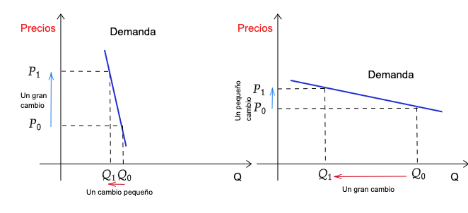

```{r meta, echo=FALSE}
library(metathis)
meta() %>%
  meta_general(
    description = "Problema económico",
    generator = "xaringan and remark.js"
  ) %>% 
  meta_name("github-repo" = "keynes37/xaringan-rladies-xalapa") %>% 
  meta_social(
    title = "Métodos en Economía",
    url = "https://spcanelon.github.io/xaringan-rladies-xalapa",
    image = "https://github.com/spcanelon/xaringan-rladies-xalapa/blob/master/xaringan-rladies-xalapa-general.png",
    image_alt = "Diapositiva para introducción a la economía",
    og_type = "website",
    og_author = "Carlos Yanes",
    twitter_card_type = "summary_large_image",
    twitter_creator = "@keynes37"
  )
```

```{r configuracion, include = FALSE}
library(knitr)
library(tidyverse)
library(datos)
library(fontawesome)
library(emo)
library(xaringanExtra)
library(pacman)
p_load(broom, latex2exp, ggplot2, ggthemes, ggforce, viridis, dplyr, magrittr, knitr, parallel, flextable)
library(babynames)
library(fontawesome) # from github: https://github.com/rstudio/fontawesome
library(DiagrammeR)
library(hrbrthemes)
library(econocharts)
library(plotly)
library(kableExtra)

# set default options
opts_chunk$set(comment = "#>",
               echo=FALSE,
               collapse = TRUE,
               dpi = 300)
#knit_engines$set("yaml", "markdown")
#xaringanExtra::use_tile_view()
#xaringanExtra::use_clipboard()
#xaringanExtra::use_share_again()
#xaringanExtra::style_share_again(
#share_buttons = c("twitter", "linkedin", "pocket")
#)
```

class: right, middle, inverse, titular
background-image: url(images/bloka.jpeg)
background-size: contain
background-position: -5cm 20%

<!---->

# `r rmarkdown::metadata$title` 
## **`r rmarkdown::metadata$subtitle`**
### `r rmarkdown::metadata$author`
### `r rmarkdown::metadata$date`

[`r fontawesome::fa("link")` Departamento de Economía](https://www.uninorte.edu.co/en/web/economia)

---
class: middle, inverse
.left-column[

# ♟

]

.right-column[
# Preguntas de algo en particular?
]
---
class: center, middle
# Volvemos al tema de individuos... 🎸

----

---
# Demanda Total

--

> Las demandas **individuales** pueden ser sumadas o adheridas para obtener la demanda *total* del mercado.

--

Suponga lo siguiente:

--

```{r, tab32, echo=FALSE, message=FALSE}
# Datos
precio<-c('$11000', '$10000', '$9000', '$8000', '$7500')
demanda1<-c(6, 8, 10, 11, 12)
demanda2<-c(8, 10, 12, 14, 15)
total<-demanda1+demanda2
df=data.frame(precio,demanda1,demanda2,total)
names(df) <- c('Precio', 'Carlos A.', 'Maria Alejandra', 'Demanda Total')

# Salida
kbl(df, caption = "Consumo de Gasolina por semana") %>%
  kable_paper("striped", full_width = F)
```
---
# Demanda Total

--

```{r trevor1, echo=FALSE, out.width="70%"}
knitr::include_graphics("images/C5g1.png")
```

---
# Demanda Total

--

`r fa("solar-panel", fill="blue")` Muchos individuos por sus gustos, preferencias, ingresos y otros elementos que tienen en cuenta para tomar una decisión de compra, afecta el consumo o **demanda**.

--

`r fa("solar-panel", fill="blue")` El **cerebro** de los individuos no es lo misma máquina de hacer cálculos. Este órgano por lo menos condiciona de acuerdo a lo que percibe, la manera de elegir y preferir algo sobre otra cosa.

--

`r fa("solar-panel", fill="blue")` Una manera o forma de medir esa sensibilidad sobre todo a los precios/costos de un mercado en particular. Conduce a mira un concepto como lo es la "Elasticidad".

--

> La elasticidad mide como una **variable** responde a los *cambios* de otra .hi-turquoise[variable] de interés. Para facilidad, esta puede ser expresada como el cambio porcentual de una variable por el *cambio porcentual* de la otra.

--

$$\epsilon^{d} = \dfrac{\dfrac{\triangle Q}{Q}}{\dfrac{\triangle P}{P}}= \frac{\text{Variación % de cantidad}}{\text{Variación % del precio}}$$

--

.hi-red[*Debe saber que*] $\triangle Q= Q_2-Q_1$, donde $Q_2$ *es el presente de la variable o tiempo actual y* $Q_1$ *viene siendo el pasado*.

---
# Demanda Total

--

#### Recuerda lo de variación?

--
>La .black[Variación Porcentual (%)]: Mide los cambios **porcentuales** de una .red[variable característica] como lo es un precio, ingreso o cantidad. Esta variación puede ser *positiva* o *negativa*.

--

`r fa("info-circle", fill="red")` Tenga en consideración que si los precios por decir un ejemplo eran de .black[`$`19000] y pasaron a ser de .red[`$`21700], entonces la variación porcentual es de:

--

$$Var\;\%=\frac{\left ( 21700-19000 \right )}{19000}\times 100= 14.2\%$$

--

Otra manera de hacerlo es con la **formula**: $\left[\frac{X_{actual}}{X_{Pasado}}-1\right] \times 100$, .hi-pink[lo que es]: $\frac{21700}{19000}-1=0.142\times 100= 14.2\%$

--

Si quiere ser mas **preciso(a)** puede usar los logaritmos neperianos: $Ln(21700)-Ln(19000)= 13.28 \approx 14.2$

---
# Demanda Total

--

> **Sensibilidad**: Como influye el precio en la decisión de compra

--

## Pregunta

--

.pull-left[
### ¿Por qué el precio de las rosas aumenta justo antes de San Valentín?
]

.pull-right[
```{r echo=FALSE, out.width = "200px"}
knitr::include_graphics("https://media.giphy.com/media/vu4ppATrotrcoiGsRi/giphy.gif")
```
]

---
# Demanda Total

--

> **Necesidades**: Muchas veces la necesidad > precio. Cuando esto ocurre la demanda será inelastica. 

--

## Pregunta

--

.pull-left[
### ¿Si es así, por qué el precio de las cervezas no aumenta justo antes de una fiesta o festival?
]

.pull-right[
```{r echo=FALSE, out.width = "400px"}
knitr::include_graphics("https://media.giphy.com/media/bIEzoZX0qJaG6s6frc/giphy-downsized-large.gif")
```
]

---
class: center, middle, inverse

# Elasticidad  🚧

----

---
# Elasticidad

--

```{r, echo=FALSE, out.width= "80%"}

```


---
# Elasticidad

--

*Recuerde*: La elasticidad puede ser .hi-red[elástica] o .black[inelástica]. Esto suele depender del ratio de la formula.

--

$$\text{Elasticidad}= \frac{\text{Cambio porcentual de Q}}{\text{Cambio porcentual de P}}=\frac{\color{#ee3636}{\text{pequeño}}\;\text{cambio}}{\color{#111FC5}{\text{Gran}\;}cambio}= \color{#ee3636}{\text{Inelastico}}$$

--

$$\text{Elasticidad}= \frac{\text{Cambio porcentual de Q}}{\text{Cambio porcentual de P}}=\frac{\color{#8411C5}{\text{Gran}}\;\text{cambio}}{\color{#ee3636}{\text{pequeño}\;}cambio}= \color{#8411C5}{\text{Elastico}}$$

--

`r fa("satellite-dish", fill="blue")` La respuesta (magnitud) de la elasticidad, brinda tambien información referente a cuando un bien posee muchos **sustitutos** o pocos.

---
# Elasticidad

--

```{r, echo=FALSE, out.width= "80%"}

```
---
# Elasticidad

--

```{r, echo=FALSE, out.width= "80%"}

```


---
# Elasticidad

--

+ Miremos que ocurre con las personas del .hi-slayer[*ejemplo*] inicial:

--

```{r, elast1, echo=FALSE, message=FALSE}
# Datos
precio<-c(11000, 10000, 9000, 8000, 7500)
demanda1<-c(6, 8, 10, 11, 12)
demanda2<-c(8, 10, 12, 14, 15)
total<-demanda1+demanda2
df1=data.frame(precio,demanda1,demanda2,total)

df1%>%
  mutate(varP=((precio-lag(precio))/lag(precio))) %>%
  mutate(varQ=((total-lag(total))/lag(total)))%>%
  mutate(Elas=(varQ/varP))%>%
  rename("Precio"= precio,
         "Carlos"= demanda1,
         "Maria"= demanda2,
         "Demanda"= total,
         "Var % Precio"= varP,
         "Var % Demanda"=varQ,
         "Elasticidad"= Elas)%>%
          kbl() %>% kable_paper("striped", full_width = F)
```

---
# Elasticidad

--

```{r, include=FALSE}
datab <-
  data.frame(
    Elasticidad = c(
      "Perfectamente Inelástica",
      "Relativamente Inelástica",
      "Unitaria",
      "Relativamente Elastica",
      "Perfectamente Elástica"
    ),
    Coeficiente = c(
      "E=0 ",
      "0>E>-1",
      "E=-1",
      "-1>E>-inf",
      "E=Infinito"
    ),
    Interpretacion = c("Precio no importa", 
                       "Precio es menos importante que la cantidad comprada",
                       "Precio y cantidad igual de importantes",
                       "Precio es muy importante",
                       "El precio lo es todo")
    )
```

```{r,echo=FALSE}
tab01 <- as.data.frame(datab)
kbl(tab01) %>%
  kable_classic("hover")
```
---
class: inverse, middle

# Qué es todo esto? 😫

---
class: title-slide-section-grey, middle, center
background-image: url(https://media.giphy.com/media/xT9KVeFE2nVjxCFPJm/giphy.gif)
background-size: cover
---
class: inverse, middle

# Qué ocurre si la elasticidad no es la misma cuando $P_1 \Rightarrow P_2$ y $P_2 \Rightarrow P_1$

---
# Elasticidad Arco

--

`r fa("sketch", fill="green")` Es una medida menos *exacta* pero mantiene el movimiento, .red[signo] y .black[**valor**].

--

Su .pink[formula] viene a ser:

--

$$\text{Elasticidad}_{arco}= \frac{\text{Cambio porcentual promedio de Q}}{\text{Cambio porcentual promedio de P}}= \color{#ee3636}{\text{Valor elasticidad}}$$
--

<font size="+5">$$\frac{\frac{\triangle Q}{(Q_2+Q_1/2)}}{\frac{\triangle P}{(P_2+P_1/2)}}$$</font>
---
# Elasticidad Arco

--

+ Miremos que ocurre con la **elasticidad arco** de las personas del .hi-slayer[*ejemplo*] inicial:

--

```{r, echo=FALSE}
# Datos
precio<-c(11000, 10000, 9000, 8000, 7500)
demanda1<-c(6, 8, 10, 11, 12)
demanda2<-c(8, 10, 12, 14, 15)
total<-demanda1+demanda2
df2=data.frame(precio,demanda1,demanda2,total)

df2%>%
  mutate(varP=(precio-lag(precio))) %>%
  mutate(varQ=(total-lag(total)))%>%
  mutate(Elasc=(varQ/((total+lag(total))/2))/(varP/((precio+lag(precio))/2)))%>%
  rename("Precio"= precio,
         "Carlos"= demanda1,
         "Maria"= demanda2,
         "Demanda"= total,
         "Diferencia Precio"= varP,
         "Diferencia Demanda"=varQ,
         "Elasticidad Arco"= Elasc)%>%
          kbl() %>% kable_paper("striped", full_width = F)
```
--

<font size="+5">$$E_{\text{arco}}=\frac{\frac{4}{(18+14)\div2}}{\frac{-1000}{(10000+11000)\div2}}=-2,625$$</font>


---
class: title-slide-section-grey, middle, center
background-image: url(https://media.giphy.com/media/WocDy1iZ3AudkEcg8g/giphy.gif)
background-size: cover

---
class: inverse, middle

# Otros asuntos de la elasticidad... 💰
----

---
# Elasticidad cruzada

--

`r fa("smile", fill="yellow")` Similar que cuando cambia los ingresos podemos hacer uso del .mono[denominador] de la expresión y usarlo con variables como .red[precio sustitutos], **precio complementarios** e incluso el mismo .pink[ingreso] 💵.

--

Las *formulas no se modifican casi nada*:

--

<font size="+5">$$\text{Elasticidad cruzada}=\frac{\frac{\triangle Q}{Q}}{\frac{\triangle P_s}{P_s}} \quad \vee \quad \frac{\frac{\triangle Q}{Q}}{\frac{\triangle I}{I}}$$</font>

--

Note que nunca cambia el .mono[numerador] siempre serán las .red[cantidades] .hi-slayer[variable de interés]. Solo debe estar atento al *signo* y a la .pink[magnitud] para poder clasificar la sensibilidad.

--

`r fa("satellite-dish", fill="blue")` La respuesta (magnitud) de la elasticidad, brinda también información referente a cuando un bien posee muchos **sustitutos** o pocos.

---
# Elasticidad cruzada

--

## `r fontawesome::fa("ruler")` Responda lo siguiente:

.left-column[Piense que el precio de un producto subió en un 1.5% y la cantidad de demanda se redujo en 3.5%. ¿Cuál es la elasticidad precio?]

--

<font size="+5">$$\frac{-0.035}{0.015}=-2.33$$</font>

--

<font size="+5">Es elástico </font>

---
# Elasticidad cruzada

--

## `r fontawesome::fa("ruler")` Responda lo siguiente:

.left-column[Piense que el ingreso de un individuo subió en un 6.5% y la cantidad de demanda aumentó en 4.5%. ¿Cuál es la elasticidad ingreso?]

--
<font size="+5">$$\frac{0.045}{0.065}=0.69$$</font>

--

<font size="+5">Es inelástico</font>

---
# Elasticidad cruzada

--

`r fa("store", fill="red")` Desde luego hallar la **elasticidad** no es un trabajo trivial. Mostramos algunos ejemplos de artículos donde han hallado sus elasticidades:

--

| **Bien o Servicio**  | Elasticidad- Precio |
| -------------------- | ------------------- |
| Lentejas             | \-2,8               |
| Energia (Air-e)      | \-1,2               |
| Cerveza              | \-1,19              |
| Netflix              | \-0,85              |
| Viajes en avión      | \-0,77              |
| Zapato y calzado     | \-0,6               |


---
# Bibliografía

`r fa('book')` Acemoglu, D., Laibson, D., & List, J. A. (2017). *Economía*. Antoni Bosch editor.

`r fa('book')` Mateer, D., & Coppock, L. (2021). *Principles of Microeconomics.* WW Norton & Company.

---
name: adios
class: middle, inverse

.pull-left[
# **¡Gracias!**
<br/>
## Elasticidad

### Seguimos aprendiendo
]

.pull-right[
.right[


[`r fontawesome::fa("link")` Syllabus/ Curso](https://pomelo.uninorte.edu.co/pls/prod/bwckctlg.p_disp_course_detail?cat_term_in=202210&subj_code_in=ECO&crse_numb_in=0010)<br/>
[`r fontawesome::fa("twitter")` @keynes37](https://twitter.com/keynes37)<br/>
[`r fontawesome::fa("paper-plane")` cayanes@uninorte.edu.co](mailto:cayanes@uninorte.edu.co)
]
]

???
¡Gracias por tu atención! 
En este momento me encantaría tomar preguntas y si me quieren contactar no olviden enviar un email.
