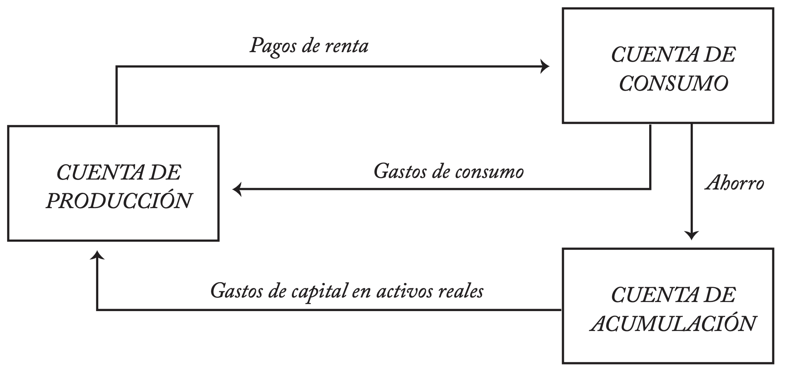
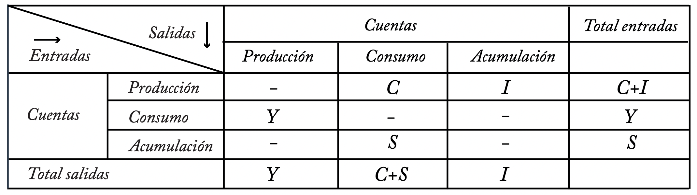
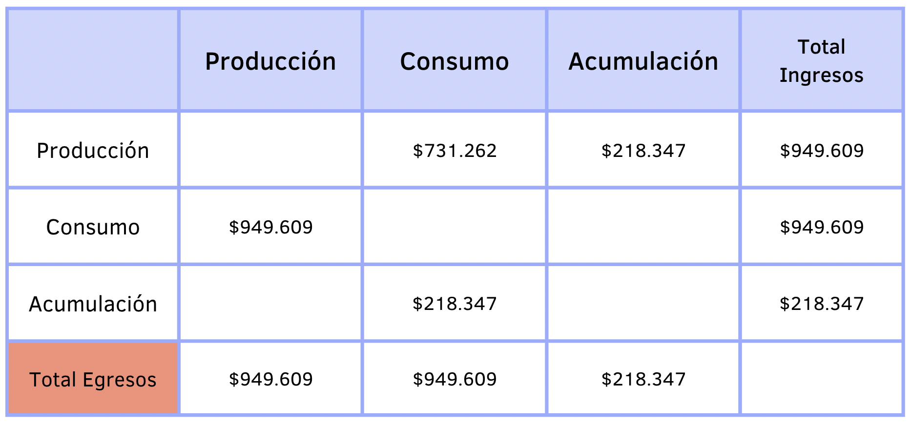
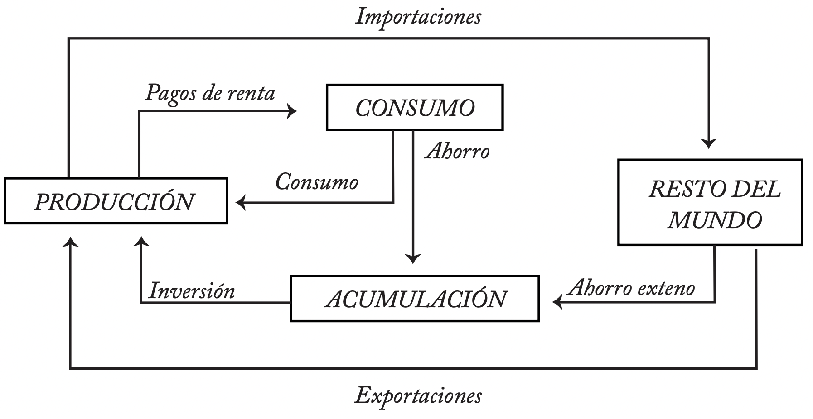
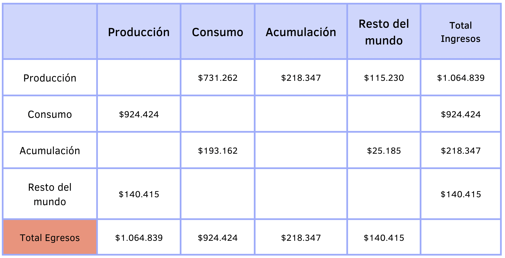
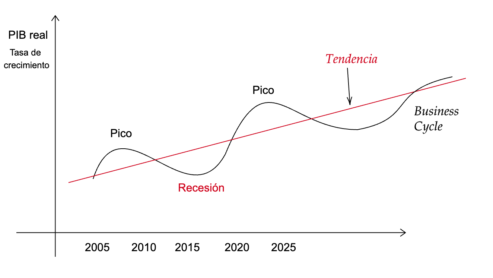

```{r meta, echo=FALSE}
library(metathis)
meta() %>%
  meta_general(
    description = "Estado",
    generator = "xaringan and remark.js"
  ) %>% 
  meta_name("github-repo" = "keynes37/xaringan-rladies-xalapa") %>% 
  meta_social(
    title = "Métodos en Economía",
    url = "https://spcanelon.github.io/xaringan-rladies-xalapa",
    image = "https://github.com/spcanelon/xaringan-rladies-xalapa/blob/master/xaringan-rladies-xalapa-general.png",
    image_alt = "Diapositiva para introducción a la economía",
    og_type = "website",
    og_author = "Carlos Yanes",
    twitter_card_type = "summary_large_image",
    twitter_creator = "@keynes37"
  )
```

```{r configuracion, include = FALSE}
library(knitr)
library(tidyverse)
library(datos)
library(fontawesome)
library(emo)
library(xaringanExtra)
library(pacman)
p_load(broom, latex2exp, ggplot2, ggthemes, ggforce, viridis, dplyr, magrittr, knitr, parallel, flextable)
library(babynames)
library(treemapify)
library(fontawesome) # from github: https://github.com/rstudio/fontawesome
library(DiagrammeR)
library(hrbrthemes)
library(econocharts)
library(plotly)
library(kableExtra)

# set default options
opts_chunk$set(comment = "#>",
               echo=FALSE,
               collapse = TRUE,
               dpi = 300)
#knit_engines$set("yaml", "markdown")
#xaringanExtra::use_tile_view()
#xaringanExtra::use_clipboard()
#xaringanExtra::use_share_again()
#xaringanExtra::style_share_again(
#share_buttons = c("twitter", "linkedin", "pocket")
#)
```

class: right, middle, inverse, titular
background-image: url(images/unnort.jpeg)
background-size: contain
background-position: -10cm 30% 

<!---->

# `r rmarkdown::metadata$title` 
## **`r rmarkdown::metadata$subtitle`**
### `r rmarkdown::metadata$author`
### `r rmarkdown::metadata$date`

[`r fontawesome::fa("link")` Departamento de Economía](https://www.uninorte.edu.co/en/web/economia)

---
class: middle, inverse
.left-column[

# 🌲

]

.right-column[
# Como están los ánimos?
]

---
class: middle, center
background-image: url(https://media.giphy.com/media/2dox5FPVAwsZhlXuD2/giphy.gif)
background-size: cover

# Con toda!!...

---
# Para hoy... intentamos aprender

--

1. Conocer el proceso de **cuentas nacionales** y .red[**contabilidad**] nacional

--

1. Hablar de medición **económica** en el .red[**País**]

--

1. Mirar las variables macroeconómicas en la .red[**economía**]

--

1. Conocer de las funciones del **DANE**.

---
class: center, middle
# Cuentas nacionales... 🌿

----

---
layout: true
# Cuentas Nacionales

---

--

`r fa("sketch", fill="red")` **Actividades económicas** son aquellas concebidas como *Producción*, *Consumo* y *Acumulación*. En ellas los distintos .ul[ciudadanos] realizan transacciones.

--

Dentro de todo tenemos .red[**macrosectores**] como la **Nación/estado** y entra también el **sector externo**

--

```{r, out.width = "600px"}

```

Fuente: Lora, E., y Prada, S. I. (2008).
---

--

### Sistema simplificado de transacciones

--

1. .red[Transacciones reales]: *Aquellas que brindan un traspaso o poder especial (dominio) de un bien o servicio*.

--

1. .blue[Agentes económicos]: *Se toman de forma agregada*

--

1. .red[Macrosectores]: *El regimen institucional que de alguna u otra forma hace transacciones reales y financieras*

--

#### Sistema de cuentas

--

$$Y= C + I$$

--

Donde la producción (Y) es el resultado de la suma de (C)onsumo e (I)nversión de los agentes de una economía.

--

Desde luego podemos también tener dentro de la versión de pago:

--

$$Y= C + S$$
--

El ahorro nos permite tener finalmente lo esencial y clave en **Macroeconomía** que es la ecuación de $I=S$

---

--

#### Matriz de contabilidad

--

```{r, out.width = "700px"}

```

--

Ahora asuma que el DANE nos ha dicho que para cierto año el consumo ha sido de `$731.262` y la parte de inversión es `$218.347`. Con esto es suficiente entonces para tener:

--

$$Y=C+I\quad \Rightarrow Y=731262+218347=949609$$ 

--

Recuerde ademas que $S=I$ por ende: $S=218347$

---

--

#### Ejemplo de la matriz

--

```{r, out.width = "600px"}

```

---

--

### Inclusión del sector externo

--

```{r, out.width = "700px"}

```

Fuente: Lora, E., y Prada, S. I. (2008).

---

--

### Sistema de economía abierta

--

`r fa("sketch", fill="red")` Debemos *lidear* con nuevas ecuaciones para tener un sistema mas completo:

--

* .red[**Cuenta total**] $C+I+X=Y+M$

--

* .red[**Cuenta de consumo**] $Y=C+I$

--

* .red[**Cuenta de acumulación**] $S+S_x=I$

--

* .red[**Cuenta resto del mundo**] $M=X+S_x$

--

Ahora con los mismos datos que nos ha dicho el DANE para cierto año el consumo ha sido de `$731.262` y la parte de inversión es `$218.347`. Entran a jugar las exportaciones con `$115.230` y unas importaciones de alrededor `$140.415`. Nuestra ecuación general o .ul[sistema] queda como:

--

$$
\begin{aligned}
Y=C+I+X-M=& \quad 731.262+218.347+115.230-140.415=924424\\
M-X=& \quad S_x=140.415-115.230=\color{#0961ed}{\$25185}\\
S=I-Sx=& \quad \color{#ff8708}{218.347} - \color{#0961ed}{25185}= 193162
\end{aligned}
$$

---

--

### Representación matricial

```{r, out.width = "700px"}

```

---
layout: false
class: center, middle
# Producto interno bruto... ☘️

----

---
layout: true
# Producto Interno Bruto (PIB)

---

--

### Enfoque Macroeconómico

--

```{r tabeco, echo=FALSE}
library(kableExtra)
text_tbl <- data.frame(
  Items = c("Ingreso", "Producto","Empleo", "Precios"),
  Microeconomía = c(
    "El ingreso/ganancia de una persona/firma",
    "La producción de un trabajador, empleado, firma", 
    "Condición laboral de la persona",
    "El precio de un solo bien/servicio"
  ),
  Macroeconomía = c ("El ingreso de toda una nación",
                     "La producción de toda la economía",
                     "El total de la población que este en nivel laboral",
                     "Inflación/deflación, indice de todos los precios")
)

kbl(text_tbl) %>%
  kable_paper(full_width = F) %>%
  column_spec(1, bold = T, color = "black", border_right = T) %>%
  column_spec(2, width = "20em", background = "lightgreen") %>%
  column_spec(3, width = "20em", bold = F, color = "black", border_left = T)
```
---

--

### Enfoque Macroeconómico

--

**PIB** .hi-slate[Producto Interno Bruto]: Es el ***valor de mercado*** de todos los bienes/servicios que se producen en una economía, regularmente en un año en particular y dentro de las .hi-turquoise[fronteras]. Sin importar si lo produce incluso personas de otros países pero radicados en el interior del territorio.

--

**PNB** .hi-slate[Producto Nacional Bruto]: -*es muy poco usado*- sin embargo, es todo lo producido por naturales/nacionales de un país dado. P.e: Una empresa Colombiana radicada en Chile.

--

`r fa("registered", fill="blue")` Estas dos medidas permiten establecer un termómetro dentro de una economía. Si el **PIB** crece, entonces la economía va bien.

--

`r fa("registered", fill="blue")` El **PIB** puede ser medido de distintas maneras, sin embargo uno de los usos va en referencia al .hi-turquoise[real] (donde se tiene en cuenta el efecto de los precios) y por otro lado el .hi-turquoise[nominal].
---

--

### Enfoque de valor agregado

--

```{r tabagregado, echo=FALSE}
library(kableExtra)
text_tbl <- data.frame(
  Etapas = c("I", "II","III", "IV", "Total transacción"),
  Transacción = c(
    "Un agricultor siembra y cultiva papa la vende en 45000",
    "Un comerciante/intermediario la lava y la corta y la vende en 65000", 
    "Un empacador plastifica y recorta la papa y la vende en 75000",
    "Un puesto de comidas vende 10 unidades en 20000 al consumidor final 200 mil",
    "Precio final $200.000"
  ),
  'Valor Agregado' = c("45000",
                     "20000",
                     "10000",
                     "125000",
                     "Total: $200000")
)

kbl(text_tbl) %>%
  kable_paper(full_width = F) %>%
  column_spec(1, bold = T, color = "black", border_right = T) %>%
  column_spec(2, width = "20em", bold = F, color = "black", border_left = T) %>%
  column_spec(3, width = "20em", bold = F, color = "red", border_left = T)
```

--

El .hi-orange[Valor Agregado] adjunta las fases del precio final de un producto. Por eso el DANE para evitar la doble contabilidad solo tiene en cuenta las transacciones finales.
---
layout: false
class: inverse, middle

# Qué es todo esto? 😫

---
class: middle, center
background-image: url(https://media.giphy.com/media/SwCDiZGmLG5Dc1X3Uv/giphy.gif)
background-size: cover
---
layout: true

# Economía en el sentido Macro

---

--

### Ciclos en economía

--


```{r, out.width = "700px", fig.align='center'}

```

---

--

### PIB Nominal

--

```{r, out.width = "400px", fig.align='center'}

```

```{r, echo=FALSE}
# Datos
Producto<-c("Yuca", "Vehículos", "Flores")
Cantidad<-c(4700, 9200, 700)
Precios<-c(2800, 120000, 15)
df1=data.frame(Producto, Cantidad, Precios)

df1%>%
  mutate(tot=(Cantidad*Precios))%>%
  mutate(tot = format(tot, scientific = FALSE, big.mark = ","))%>%
  rename("Total "= tot)%>%
          kbl() %>% kable_paper("striped", full_width = F)
```

--

$$\text{PIB}_{nominal}=13,160,000+1,104,000,000+10,500=1,117,170,500$$
---

--

### PIB Real

--

```{r pibreal, echo=FALSE}
library(kableExtra)
text_tbl1 <- data.frame(
  Años = c(2018:2023),
  PIB = c(29871121, 29901211,30412921,30612971,30512724,30812929),
  Deflactor = c(93,96,98,100,102,108)
)

kbl(text_tbl1) %>%
  kable_paper(full_width = F) %>%
  column_spec(1, bold = T, color = "black", border_right = T) %>%
  column_spec(2, width = "10em", bold = F, color = "black", border_left = T) %>%
  column_spec(3, width = "10em", bold = F, color = "red", border_left = T)
```
--

$$\text{PIB}_{real}=\frac{PIB_{nominal}}{Deflactor}\times100= \frac{29871121}{93}\times 100=32,119,485$$

---

--

### PIB Real

--

`r fa("sketch", fill="red")` Hay otra manera un poco mas extensa para calcular el PIB real y esta es con los precios que se designan del año base.

--

`r fa("sketch", fill="red")` El deflactor lo brinda el DANE a partir de la cesta que estos estiman conveniente y tambien de acuerdo a la metodología.

---
layout:false
class: inverse, middle

# Y... como seria eso? 🥺

---
layout:true
# Cálculo PIB real via precios

---

--

### Economía de precios corrientes

```{r, tablacorriente, echo=FALSE}
#data
library(kableExtra)
db15 <- data.frame(
  Bienes = c("Arroz", "Cereales", "Bebidas", "Salud"),
  C1 = c(30,10,5,7),
  P1 = c(1600, 4500, 6700, 12400),
  C2 = c(35,12,7,10),
  P2 = c(1650, 4600, 6780, 13200),
  C3 = c(33,11,6,8),
  P3 = c(1700, 4700, 6790, 13400)
  )

dbt<-db15 %>%
  mutate('PIB Nominal 1'=C1*P1, .after = P1)%>%
  mutate('PIB Nominal 2'=C2*P2, .after = P2)%>%
  mutate('PIB Nominal 3'=C3*P3, .after = P3)
kbl(dbt) %>%
  kable_classic() %>%
  add_header_above(c(" " = 1, "Año 2020" = 3, "Año 2021" = 3, "Año 2022" = 3))%>%
  column_spec(4, bold = F, color = "red", border_left = F)%>%
  column_spec(7, bold = F, color = "red", border_left = F)%>%
  column_spec(10, bold = F, color = "red", border_left = F)
  
```
---

--

### Economía de precios reales año base 2020

```{r, tablareal, echo=FALSE}
#data
library(kableExtra)
db16 <- data.frame(
  Bienes = c("Arroz", "Cereales", "Bebidas", "Salud"),
  C1 = c(30,10,5,7),
  P1 = c(1600, 4500, 6700, 12400),
  C2 = c(35,12,7,10),
  P2 = c(1600, 4500, 6700, 12400),
  C3 = c(33,11,6,8),
  P3 = c(1600, 4500, 6700, 12400)
  )

dbt1<-db16 %>%
  mutate('PIB Real 1'=C1*P1, .after = P1)%>%
  mutate('PIB Real 2'=C2*P1, .after = P2)%>%
  mutate('PIB Real 3'=C3*P1, .after = P3)
kbl(dbt1) %>%
  kable_classic() %>%
  add_header_above(c(" " = 1, "Año 2020" = 3, "Año 2021" = 3, "Año 2022" = 3))%>%
  column_spec(4, bold = F, color = "blue", border_left = F)%>%
  column_spec(7, bold = F, color = "red", border_left = F)%>%
  column_spec(10, bold = F, color = "red", border_left = F)
```


---
layout:false
# Bibliografía

`r fa('book')` Lora, E., & Prada, S. I. (2008). *Técnicas de medición económica*. Metodología y aplicaciones en Colombia, ICESI.

`r fa('book')` Mateer, D., & Coppock, L. (2021). *Principles of Microeconomics.* WW Norton & Company.

`r fa('book')` Acemoglu, D., Laibson, D., & List, J. A. (2017). *Economía*. Antoni Bosch editor.

---
name: adios
class: middle, inverse

.pull-left[
# **¡Gracias!**
<br/>
## Cuentas Nacionales

### Seguimos aprendiendo
]

.pull-right[
.right[


[`r fontawesome::fa("link")` Syllabus/ Curso](https://pomelo.uninorte.edu.co/pls/prod/bwckctlg.p_disp_course_detail?cat_term_in=202210&subj_code_in=ECO&crse_numb_in=0010)<br/>
[`r fontawesome::fa("twitter")` @keynes37](https://twitter.com/keynes37)<br/>
[`r fontawesome::fa("paper-plane")` cayanes@uninorte.edu.co](mailto:cayanes@uninorte.edu.co)
]
]

???
¡Gracias por tu atención! 
En este momento me encantaría tomar preguntas y si me quieren contactar no olviden enviar un email.


