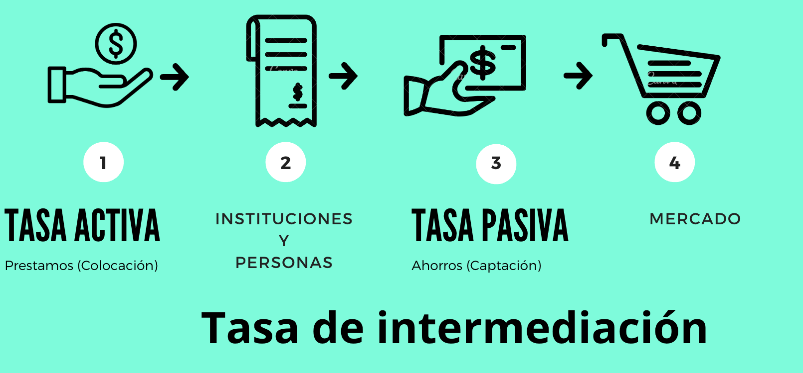

```{r meta, echo=FALSE}
library(metathis)
meta() %>%
  meta_general(
    description = "Money",
    generator = "xaringan and remark.js"
  ) %>% 
  meta_name("github-repo" = "keynes37/xaringan-rladies-xalapa") %>% 
  meta_social(
    title = "Métodos en Economía",
    url = "https://spcanelon.github.io/xaringan-rladies-xalapa",
    image = "https://github.com/spcanelon/xaringan-rladies-xalapa/blob/master/xaringan-rladies-xalapa-general.png",
    image_alt = "Diapositiva para introducción a la economía",
    og_type = "website",
    og_author = "Carlos Yanes",
    twitter_card_type = "summary_large_image",
    twitter_creator = "@keynes37"
  )
```

```{r configuracion, include = FALSE}
library(knitr)
library(tidyverse)
library(datos)
library(fontawesome)
library(emo)
library(xaringanExtra)
library(pacman)
p_load(broom, latex2exp, ggplot2, ggthemes, ggforce, viridis, dplyr, magrittr, knitr, parallel, flextable)
library(babynames)
library(treemapify)
library(fontawesome) # from github: https://github.com/rstudio/fontawesome
library(DiagrammeR)
library(hrbrthemes)
library(econocharts)
library(plotly)
library(kableExtra)
library(shiny)

# set default options
opts_chunk$set(comment = "#>",
               echo=FALSE,
               collapse = TRUE,
               dpi = 300)
#knit_engines$set("yaml", "markdown")
#xaringanExtra::use_tile_view()
#xaringanExtra::use_clipboard()
#xaringanExtra::use_share_again()
#xaringanExtra::style_share_again(
#share_buttons = c("twitter", "linkedin", "pocket")
#)
```

class: right, middle, inverse, titular
background-image: url(images/bankclip.jpg)
background-size: contain
background-position: -5cm 20% 

<!---->

# `r rmarkdown::metadata$title` 
## **`r rmarkdown::metadata$subtitle`**
### `r rmarkdown::metadata$author`
### `r rmarkdown::metadata$date`

[`r fontawesome::fa("link")` Departamento de Economía](https://www.uninorte.edu.co/en/web/economia)

---
class: middle, inverse
.left-column[

# 😎 

]

.right-column[
# Preguntas de la clase anterior?
]

---
name: menu
background-image: url("images/money1.jpg")
background-size: cover
class: left, middle, inverse

# Contenido

----


.pull-left[
### `r icon("xing")` [Historia](#Historia)

### `r icon("upload")` [Tématica](#Tematica)

### `r icon("broom")` [Expansión Monetaria](#Expansion)

]


.pull-right[

### `r icon("dice-d6")` [Ejemplos](#Causalidad)

]
---
class: center, middle
# Historia del dinero (𝔪)

----


---
name: Historia
# Historia del dinero

--

```{r, out.width = "800px"}

```
---
# Historia del dinero

--

### De la linea de tiempo

--

* Antes en el 2000 **B.C**: Solo se manejaba .hi-pink[trueque] por parte de compradores y vendedores. Se tramitaban los *excesos* o lo que sobraba.

--

* Para el 1500 **B.C**: En .ul[Asia] ya se tenían las primeras monedas metálicas (cobre). Muchas de ellas al principio tenían un *símbolo* de poder que representaba al rey, dios o .hi-pink[emblema], facilitaba mucho las transacciones.

--

* Para 650-336 **B.C**: En Turquía , la parte del imperio de Alejandro Magno manejaban su propia *moneda* (metálico) pero ya en oro y con figuras como un León.

--

* Siglo **VII**: Dinastía Tang en .ul[China], se hace registro del primer papel moneda. *Era igual mas preferible el metálico*. En europa el primer país en hacerlo fue en .ul[Suecia] en 1661. Para USA el dolar fue dado en 1690.

--

* Para **757-2011**: Se crearon en Inglaterra los primeros cajeros automáticos y desde ahí se ha evoluciado con los distintos medios de pagos.

--

* Presente: .hi-slate[Cryptocurrencies]...

---
name: Tematica
class: middle, inverse

--

# Definición del dinero 🤞🏻 

---
# Definición
--

### Definición

> El .b[dinero] es un activo que la gente utiliza para realizar y recibir pagos cuando compra bienes y servicios

--

### Tiene ciertas funciones

--

`r fa("bitcoin", fill="blue")` Unidad de cuenta

--

`r fa("bitcoin", fill="gold")` Medio de pago y cambio

--

`r fa("bitcoin", fill="blue")` Deposito de valor

---
class: middle, inverse

--

# Y como se explica lo anterior? 🥶

---
# Funciones del Dinero

--

## Unidad de cuenta

--

> Es una medida universal empleada para expresar los precios relativos de bienes y servicios

--

```{r, out.width='70%', fig.align='center', fig.cap='Unidad de cuenta'}
knitr::include_graphics('Images/C8gr02.png')
```

--

En algunas ocasiones se le conoce como **moneda teórica** de existencia no física, no se acuña (es "imaginaria")


---
# Funciones del Dinero

--

### Medio de pago

--

> Es un activo que puede intercambiarse con bienes y servicios

--

```{r, out.width='70%', fig.align='center', fig.cap='Medio de pago'}
knitr::include_graphics('Images/clase08pic1.png')
```

--

Hoy en día el reconocimiento va en todo el tipo de dinero que se usa para .hi[tranzar] como efectivo, 🛒 tarjetas débito y crédito, cheques y cuentas corrientes.

---
# Funciones del Dinero

--

### Deposito de valor

--

> Poder de comprar algo a futuro. Protección frente a imprevistos e incluso la capacidad de poder comprar bienes y servicios en el futuro. Tambien se le conoce como reserva de valor

--

```{r, out.width='70%', fig.align='center', fig.cap='Deposito de valor'}

```

--

Transferimos poder .ul[adquisitivo] del presente al futuro. Si ganamos hoy 3 millones podemos guardalo hoy y gastarlo en el futuro (con expectativa que nos alcance para comprar mas). Con el .hi[Dinero] de otros países/lugares puedes transformar tus pagos y mantener lo que se define como .hi-blue[bienestar]. Pretendemos que nuestra riqueza se mantenga en el tiempo.

---
# Funciones del Dinero

--

## `r fontawesome::fa("ruler")` Responda lo siguiente:

.left-column[De la siguiente lista establezca quienes cumplen de estos artículos cumplen con las funciones de dinero]

--

.right-column[ Qué funciones cumple:

| Bien           | Medio de Pago | Deposito de valor  | Unidad de cuenta |
| -------------- | ------------- | ------------------ | ---------------- |
| Concha Marina  |               |                    |                  |  
| Vaca           |               |                    |                  |
| Moneda de oro  |               |                    |                  |
| Dolár          |               |                    |                  |
| Bitcoin        |               |                    |                  |

]
---
class: inverse, middle


# Y entonces que es eso de Dinero fiduciario?
----

> Un activo que se usa como dinero legal por .hi[decreto] y que no esta respaldado por un bien físico como el .hi[oro].


---
class: right, middle, inverse, titular
background-image: url(images/bank08.jpeg)
background-size: contain
background-position: -3cm 60% 

## Cuál es el papel <br>
## de los bancos?

#### Comerciales...

---
# Bancos Comerciales

--

Ya teniendo en mente la **definición** de .hi[dinero], podemos entonces empezar a pensar en las .hi-purple[monedas corrientes] y los .hi-slate[depositos] en un banco. Regularmente las personas/empresas no tienen potestad de .b[imprimir] dinero ni ofertar dinero en una economía. Para esto intentaremos explicar como estos bancos .hi-green[crean] dinero.

--

```{r, out.width='50%', fig.align='center', fig.cap='Intermediario central'}

```

---
name: politica
background-image: url("images/banrep.jpg")
background-size: cover
class: left, middle, inverse

# Banco de la república

----


---
class: right, middle, inverse, titular
background-image: url(images/banrep2.jpg)
background-size: contain
background-position: -1cm 60% 

## Cuál es el papel <br>
## del banco central?
---
# Banco central

+ La oferta es la cantidad de dinero en una economía.

--

+ La política va en como controlar la oferta de dinero.

--

### Funciones principales

--

`r fa("cc-visa", fill="blue")` Supervisa las instituciones financieras.
`r fa("cc-paypal", fill="blue")` Controla algunos tipos de interés clave.
`r fa("cc-visa", fill="red")` Indirectamente controla la masa/base monetaria.

--

| Símbolo | Activos                                                                 |
|---------|-------------------------------------------------------------------------|
| E       | Efectivo en manos del público (billetes y monedas en circulación)      |
| B       | E + Reservas bancarias (E más lo que los bancos tienen en el central)  |
| M1      | E + Depósitos a la vista (dinero disponible para uso inmediato)        |
| M2      | M1 + Cuasidineros (ahorros y depósitos a plazo convertibles en dinero) |

---
# Banco central

--

```{r, out.width='70%', fig.align='center'}

```


---
# Banco central

--

| **Activos**                     |      |      | **Pasivos**                          |
|---------------------------------|------|------|--------------------------------------|
| Reservas Internacionales        |      |      |      Efectivo                        |
| Papeles del gobierno (TES)      |      |      |      Reservas de encaje              |
| Prestamos al sistema financiero |

--

### Ademas

--

`r fa("landmark", fill="red")` Crea dinero
`r fa("landmark", fill="red")` Cuida inflación
`r fa("landmark", fill="red")` Comunica la .hi[politica monetaria] y es banco de bancos

---
# Banco central

--

```{r, out.width='60%', fig.align='center', fig.cap='Inflación vs Oferta Monetaria'}
knitr::include_graphics('https://upload.wikimedia.org/wikipedia/commons/9/92/Money_supply_growth_vs_inflation_rates.png')
```


---
class: middle, inverse

--

# Cuanto dinero hay en la economía? 💰 

---
# Cantidad de piezas en la economía

--

.pull-left[
```{r, echo=FALSE, out.width='80%', message=FALSE, fig.align='center', fig.cap='Piezas Circulante'}
# Cargar librerías necesarias
library(ggplot2)
library(dplyr)

# Crear datos de prueba
data <- data.frame(
  category = c("100 mil Pesos", "50 mil Pesos", "20 mil Pesos", "10 mil Pesos", "5 mil Pesos", "2 mil Pesos", "mil Pesos"),
  count = c(326.5, 1536.9, 343.7, 236.8, 200.1, 549, 109)
)

# Calcular porcentaje y posiciones para el gráfico
data <- data %>%
  mutate(
    fraction = count / sum(count),           # Porcentaje
    ymax = cumsum(fraction),                # Acumulado superior
    ymin = c(0, head(ymax, n = -1)),        # Acumulado inferior
    labelPosition = (ymax + ymin) / 2,      # Posición de la etiqueta
    label = paste0(category, "\n", round(fraction * 100, 1), "%\n", count, "M")  # Etiqueta con porcentaje y valor
  )

# Definir paleta de colores inspirada en los billetes colombianos
colores_billetes <- c(
  "100 mil Pesos" = "#1E90FF",  # Azul claro ($100,000)
  "50 mil Pesos" = "#228B22",   # Verde oscuro ($50,000)
  "20 mil Pesos" = "#FF4500",   # Naranja ($20,000)
  "10 mil Pesos" = "#FFD700",   # Amarillo dorado ($10,000)
  "5 mil Pesos" = "#8B008B",    # Morado ($5,000)
  "2 mil Pesos" = "#00CED1",    # Turquesa ($2,000)
  "mil Pesos" = "#A9A9A9"       # Gris (billete en desuso)
)

# Crear gráfico de anillo con etiquetas afuera
ggplot(data, aes(ymax = ymax, ymin = ymin, xmax = 4, xmin = 2.5, fill = category)) +
  geom_rect() +  # Dibujar los segmentos del anillo
  geom_label(
    aes(y = labelPosition, label = label, color = category), 
    x = 4.5,  # Colocar etiquetas fuera del anillo
    size = 3, 
    fontface = "bold", 
    fill = alpha("white", 0.7),  # Fondo blanco semitransparente
    label.padding = unit(0.2, "lines"),  # Espaciado interno
    label.size = 0.2,  # Borde fino
    show.legend = FALSE
  ) +
  scale_fill_manual(values = colores_billetes) +  # Paleta personalizada
  scale_color_manual(values = colores_billetes) + # Colores para texto
  coord_polar(theta = "y") +  # Transformar a coordenadas polares
  xlim(c(0, 5)) +  # Ajustar límites para dejar espacio a etiquetas
  labs(
    title = "Distribución de Billetes en Colombia (Millones de Piezas)", 
    subtitle = "Estimaciones basadas en datos históricos"
  ) +
  theme_void() +  # Eliminar fondo y ejes
  theme(
    legend.position = "none",  # Sin leyenda redundante
    plot.title = element_text(hjust = 0.5, size = 14, face = "bold", margin = margin(b = 10)),
    plot.subtitle = element_text(hjust = 0.5, size = 10, margin = margin(b = 20)),
    plot.margin = margin(20, 20, 20, 20)  # Margen para presentación
  )
```
Fuente: Banrep
]

.pull-right[

+ Alrededor de unas 3.302 millones de piezas de billetes.

+ Desde luego el billete de **50 mil** es el de mayor circulación. los billetes de **1000** han venido saliendo de circulación y reemplazado por moneda metalica de la nueva familia.

+ Las .hi[monedas] tiene otra dinámica, sin embargo están en consideración las de 500 y las de 1000 de la nueva familia. Las monedas de 200 se han mantenido en un valor de 1000 millones de piezas.

+ Las .hi-slate[monedas] sobrepasan con creces la cantidad de .ul[billetes] en el país.
]

---
class: middle, inverse

--

# Tendriamos un ejemplo de expasión monetaria ⁉️

---
name: Expansion
# Expansión monetaria

--

`r fa("coins", fill="red")` $M = E+D$

--

+ Los depositos de los .hi-red[privados] y .hi-red[financieros] juegan un papel circunstancial.

--

+ De la oferta monetaria tenemos unos de los principales .hi-slate[motores] de .hi[crecimiento económico].

--

### Mucho cuidado

--

Inflación que es la variación de precios tiene:
$$\pi=\dfrac{\vartriangle M }{M}-\dfrac{\vartriangle Y }{Y}$$
--

+ El .hi[crecimiento económico] normal requiere de cierto incremento en la oferta monetaria para facilitar el .hi[crecimiento] de las transacciones.
+ El .hi[crecimiento monetario] en exceso de esta cantidad genera inflación.
+ También depende del .hi[crecimiento] de los factores de producción y de la innovación tecnológica (todo esto por ahora es exógeno).

---
# Expansión monetaria

--

Suponga que el banco de la república dice que el .hi[encaje] es del 100% de los depositos. en ese caso La oferta es igual a los depositos y no hay intermediación. Para esa situación los balances son:

--

```{r tab0, echo=FALSE}
library(kableExtra)
text_tbl <- data.frame(
  Activos = c("Reserva   +$1000", "Prestamos   +$0"),
  Pasivos = c(
    "Depositos   +$1000", " "))
kbl(text_tbl, caption = "Banco de la Universidad") %>%
  kable_paper(full_width = F) %>%
  column_spec(1, bold = F, color = "red", border_right = T) %>%
  column_spec(2, bold = F, color = "red", border_left = F)

```

--

Desde luego, no hay una expasión monetaria. Ahora mire a continuación los siguientes casos

---
# Expansión monetaria

--

El banco central dice que el porcentaje de .hi[encaje] es del .hi-orange[10%] de los depósitos de los individuos

--

```{r tab1, echo=FALSE}
library(kableExtra)
text_tbl <- data.frame(
  Activos = c("Reserva   +$100", "Prestamos   +$900"),
  Pasivos = c(
    "Depositos   +$1000", " "))
kbl(text_tbl, caption = "Banco de la Universidad") %>%
  kable_paper(full_width = F) %>%
  column_spec(1, bold = F, color = "blue", border_right = T) %>%
  column_spec(2, bold = F, color = "blue", border_left = F)

```

--

Luego la persona a quien se le hace el .hi[prestamo] lo lleva a otro .hi-blue[banco] y lo deposita ahí. Ese banco ahora tendrá disponibilidad de hacer un prestamo a otro cliente.

--

```{r tab2, echo=FALSE}
library(kableExtra)
text_tbl <- data.frame(
  Activos = c("Reserva   +$90", "Prestamos   +$810"),
  Pasivos = c(
    "Depositos   +$900", " "))
kbl(text_tbl, caption = "Banco Coopercredits") %>%
  kable_paper(full_width = F) %>%
  column_spec(1, bold = F, color = "blue", border_right = T) %>%
  column_spec(2, bold = F, color = "blue", border_left = F)

```

---
# Expansión monetaria

--

Otro individuo va a otro .hi[banco] a depositar ese dinero y con eso, esa nueva institución hace un nuevo prestamo y esto puede volcarse hacia un *infinito*

--

```{r tab3, echo=FALSE}
library(kableExtra)
text_tbl <- data.frame(
  Activos = c("Reserva   +$81", "Prestamos   +$720"),
  Pasivos = c(
    "Depositos   +$810", " "))
kbl(text_tbl, caption = "Banco Navidad") %>%
  kable_paper(full_width = F) %>%
  column_spec(1, bold = F, color = "blue", border_right = T) %>%
  column_spec(2, bold = F, color = "blue", border_left = F)

```


---
# Expansión monetaria

--

`r fa("sketch", fill="red")` Note que si hacemos la operación por varias rondas mas, vamos a encontrar que:

--

| **Ronda** | **Depositos** |
|-----------|---------------|
| 1         | 1000          |
| 2         | 900           |
| 3         | 810           |
| 4         | 729           |
| .         | .             |
| .         | .             |
| .         | .             |
| .         | .             |
| .         | .             |
| Total     | 10000         |
---
# Expansión monetaria

--

> El encaje bancario lo define el banco central. A partir de lo que es este se mira como es capaz de crecer el uso del dinero en una economía

--

La **formula** del multiplicador monetario es:

--

$$\mathbb{M.M}= \frac{1}{rr}$$
--

Para este caso, como es del 10%. Vemos que la .hi[oferta] va ser de $10.000

--

$$\mathbb{O.M}= 1000 \; \times \frac{1}{0.10}=10.000$$
--

Lo que indica es que el dinero puede crecer hasta ese monto (en nuevo dinero). De ahi surgen los cupos, limites de transacciones y otros **cuasidineros**.

---
# Expansión monetaria

--

### La demostración de la sucesión:

$$
\begin{aligned}
\text{Deposito inicial}= & 1.000 \\ 
\text{Prestamos Banco 1}= & 900= (1-rr)\times 1000 + \\
\text{Prestamos Banco 2}=& 810= (1-rr)^2 \times 1000 + \\
\text{Prestamos Banco 3}=& 729= (1-rr)^3 \times 1000 + \\
\text{otros prestamos}=& \dots + 
\end{aligned}
$$

--

Por tanto,


$$\color{#0000FF}{\text{Oferta total de dinero}}= \left[1+(1-rr)+(1-rr)^{2}+(1-rr)^{3}+...\;(1-rr)^{\rho}\right] \times 1000$$


--

Desde luego hay que aprender de **regla de taylor** y también de series de **convergencia** y **divergencia**

--

> Un sistema de reserva parcial crea dinero, pero .blue[OJO], **No** crea riqueza: Los préstamos bancarios proveen nuevo dinero a los deudores pero al mismo tiempo estos contraen una deuda por el mismo valor.

---
# Expansión monetaria

--

### Qué ganan los bancos comerciales?

--

### Otras fuentes

--

```{r, out.width='50%', fig.align='center', fig.cap='Tasa de intermediación'}

```

---
# Expansión monetaria

--

### Y la parte de arbitraje de divisas?

--

```{r, out.width='60%', fig.align='center', fig.cap='Ciclos de la moneda'}

```

---
# Expansión monetaria

--

Tener una moneda **fuerte** implica que se aprecia frente a la moneda de referencia. Lo contrario ocurre cuando se deprecia (o vale menos).

--

```{r, out.width='60%', fig.align='center', fig.cap='Compra y Venta'}

```

---
class: left, middle, inverse, titular
background-image: url(images/biti.jpg)
background-size: contain
background-position: 10cm 60% 

## Es el bitcoin, dinero?

#### Crytocurrencies

---
# Bibliografía

`r fa('book')` Lora, E., & Prada, S. I. (2008). *Técnicas de medición económica*. Metodología y aplicaciones en Colombia, ICESI.

`r fa('book')` Mateer, D., & Coppock, L. (2021). *Principles of Microeconomics.* WW Norton & Company.

`r fa('book')` Acemoglu, D., Laibson, D., & List, J. A. (2017). *Economía*. Antoni Bosch editor.


---
name: adios
class: middle, inverse

.pull-left[
# **¡Gracias!**
<br/>
## Dinero

### Seguimos aprendiendo
]

.pull-right[
.right[


[`r fontawesome::fa("link")` Syllabus/ Curso](https://pomelo.uninorte.edu.co/pls/prod/bwckctlg.p_disp_course_detail?cat_term_in=202210&subj_code_in=ECO&crse_numb_in=0010)<br/>
[`r fontawesome::fa("twitter")` @keynes37](https://twitter.com/keynes37)<br/>
[`r fontawesome::fa("paper-plane")` cayanes@uninorte.edu.co](mailto:cayanes@uninorte.edu.co)
]
]

???
¡Gracias por tu atención! 
En este momento me encantaría tomar preguntas y si me quieren contactar no olviden enviar un email.


