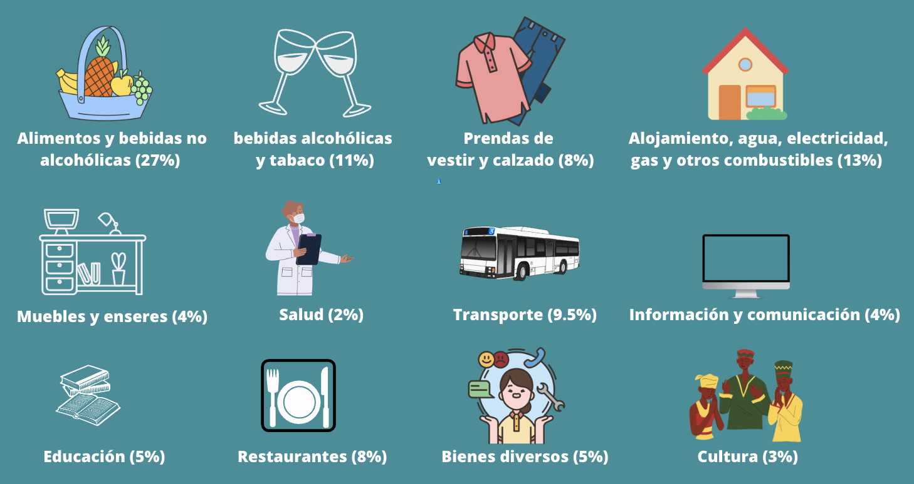
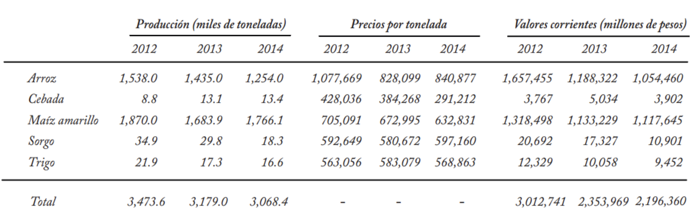
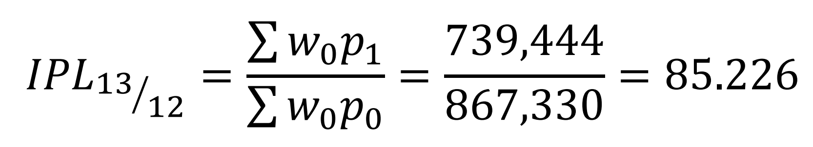
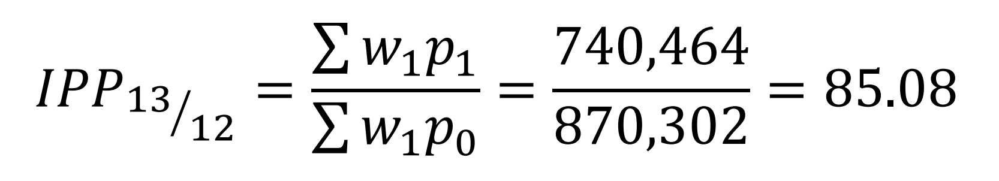
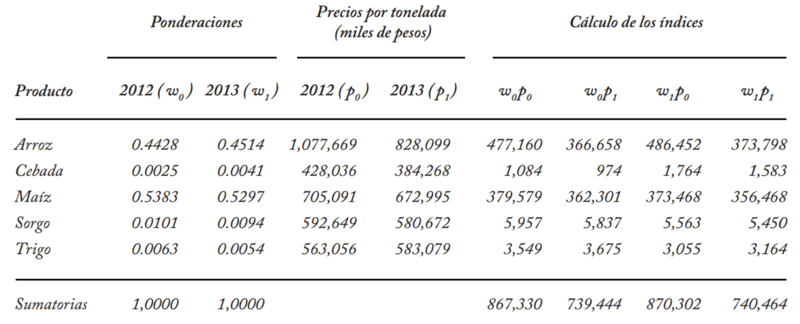

```{r meta, echo=FALSE}
library(metathis)
meta() %>%
  meta_general(
    description = "Inflación",
    generator = "xaringan and remark.js"
  ) %>% 
  meta_name("github-repo" = "keynes37/xaringan-rladies-xalapa") %>% 
  meta_social(
    title = "Inflación-Precios",
    url = "https://spcanelon.github.io/xaringan-rladies-xalapa",
    image = "https://github.com/spcanelon/xaringan-rladies-xalapa/blob/master/xaringan-rladies-xalapa-general.png",
    image_alt = "Diapositiva para introducción a la economía",
    og_type = "website",
    og_author = "Carlos Yanes",
    twitter_card_type = "summary_large_image",
    twitter_creator = "@keynes37"
  )
```

```{r configuracion, include = FALSE}
library(pacman)
p_load(broom, latex2exp, ggplot2, ggthemes, ggforce, viridis, dplyr, magrittr, knitr, parallel, flextable, xaringanExtra, knitr, tidyverse, emo, fontawesome, datos, babynames, treemapify, shiny, kableExtra, plotly, econocharts, hrbrthemes, DiagrammeR)

# set default options
opts_chunk$set(comment = "#>",
               echo=FALSE,
               collapse = TRUE,
               dpi = 300)
#knit_engines$set("yaml", "markdown")
#xaringanExtra::use_tile_view()
#xaringanExtra::use_clipboard()
#xaringanExtra::use_share_again()
#xaringanExtra::style_share_again(
#share_buttons = c("twitter", "linkedin", "pocket")
#)
```

class: right, middle, inverse, titular
background-image: url(images/infla.jpg)
background-size: contain
background-position: -8cm 20% 

<!---->

# `r rmarkdown::metadata$title` 
## **`r rmarkdown::metadata$subtitle`**
### `r rmarkdown::metadata$author`
### `r rmarkdown::metadata$date`

[`r fontawesome::fa("link")` Departamento de Economía](https://www.uninorte.edu.co/en/web/economia)

---
class: middle, inverse
.left-column[

# 💲💲 

]

.right-column[
# Preguntas de las sesiones anteriores?
]
---
class: center, middle
# 🏦Inflación⏳

----

---
class: left, middle, inverse, titular
background-image: url(Images/biuaninf.jpg)
background-size: contain
background-position: 10cm 60% 

## Temas del día

#### Introducción 
#### Conceptos Generales
#### Como medimos la Inflación
#### Tasa de interés e Inflación


---
class: inverse, center, middle
background-image: url(https://upload.wikimedia.org/wikipedia/commons/6/65/Rockstar_London_Logo.svg)
background-size: contain

# Qué es eso de la inflación?
---
class: inverse, middle, center
background-image: url(https://media.giphy.com/media/dUCSzqPRyWCg4X1s7s/giphy.gif)
background-size: cover
---

.pull-left[<font size="+7">.hi-red[TENGA PRESENTE]</font>
<br/>

]

.pull-right[
<br/>
<br/>
<br/>
<br/>
<br/>
<br/>
<br/>
<br/>
<br/>
<br/>
<br/>
<br/>
<br/>
<br/>
<br/>
<br/>
<br/>
.hi-pink[<font size="+3">¿Ha ido últimamente al supermercado y considera que las cosas cuestan mas que antes?</font>]
]
---
.top[<font size="+7">.hi-red[Ha observado ademas]</font>]
.bottom[
.left[
<font size="+4">.hi-blue[Alcanza para menos]</font>
<br/>
* Siente que con lo que actualmente dispone le alcanza para menos
]
.center[
<font size="+4">.hi-purple[El costo]</font>
<br/>
* Cada mes que pasa el precio de algún bien se ha incrementado aun mas
]
.right[
<font size="+4">.hi-blue[Ayuda adicional]</font>
<br/>
* Ha tenido en su casa/hogar a recurrir a otras fuentes como el crédito
]
]

---
# Inflación 

--

### Concepto

--

.pull-left[
<blockquote> La .hi[inflación] se define como el .hi-slate[incremento] persistente en el nivel general de los .hi[precios]. Este nivel regularmente es medido a partir del índice de precios al consumidor (IPC). </blockquote>
]

--

.pull-right[
<blockquote>Esto quiere decir que si los
precios de .hi[todos los bienes y servicios] aumentan en un 10 %, el IPC se incrementa en un 10 % reflejando estos incrementos.</blockquote>
]

--

.center[

]

---
# Inflación 

--

### Generalidades

--

`r fa("lightbulb", fill="purple")` Puede ser producto de cualquier de los lados de la economía, llámese .hi[demanda] u .hi-blue[oferta].

--

`r fa("lightbulb", fill="purple")` Se da también por efectos .hi[internos] y .b[externos].

--

`r fa("lightbulb", fill="purple")` Algunas .hi[presiones] políticas y económicas impactan en la dinámica de los precios de la economía.

--

`r fa("lightbulb", fill="purple")` Las .b[fluctuaciones] en la .hi[tasa de cambio] afectan como tal a la inflación.

---
class: inverse, right
background-image: url(Images/infcity.jpg)
background-size: cover

# .hi[Inflacion Esperada]
## 8,3% Para 2023
---
# Inflación en Colombia

--

<iframe src="https://ourworldindata.org/grapher/annual-inflation-of-consumer-prices?country=~COL" loading="lazy" style="width: 100%; height: 450px; border: 0px none;"></iframe>

---
class: middle
background-image: url(https://upload.wikimedia.org/wikipedia/commons/e/e2/Pintando_Mi_Mercado_Mercado1_%2837629722696%29.jpg)
background-size: cover

# .white[Como se mide la inflación?]
----

---
# Como se mide la inflación?

--



---
# Como se mide la inflación?

--

### Indice de Precios al Consumidor

--

<font size="+7">$$\text{IPC}= \frac{\text{Costo Cesta Periodo (t)}}{\text{Costo Cesta año base}} \; \times 100$$</font>

--

> La **cesta** es un conjunto de bienes que regularmente compran un grupo de personas.

---
# Como se mide la inflación?

--

```{r, cost1, echo=FALSE, message=FALSE}
# Datos
Periodo<-c(2019, 2020, 2021, 2022, 2023)
BienX<-c(470, 475, 482, 490, 510)
BienY<-c(510, 515, 518, 520, 530)
df1<-data.frame(Periodo,BienX,BienY)

df1%>%
  rename("Año"= Periodo,
         "Precio Bien X"= BienX,
         "Precio Bien Y"= BienY) %>%
          kbl() %>% kable_paper("striped", full_width = F)
```

--

.hi[Digamos] que se consumen 40 unidades de (X) y 25 unidades de (Y)

---
# Como se mide la inflación?

```{r, cost2, echo=FALSE, message=FALSE}
df1%>%
  mutate(Costo=BienX*40+BienY*25)%>%
  rename("Año"= Periodo,
         "Precio Bien X"= BienX,
         "Precio Bien Y"= BienY) %>%
  kbl() %>% kable_paper("striped", full_width = F)
```

.hi[Digamos] que se consumen 40 unidades de (X) y 25 unidades de (Y)

--

El .hi-blue[Costo] surge de la operación de:

<font size="+4">$$\text{Costo}_{2019}= 470 \times (40) + 510 \times (25)= 31.550 $$</font>

---
# Como se mide la inflación?

```{r, cost3, echo=FALSE, message=FALSE}
df1%>%
  mutate(Costo=BienX*40+BienY*25)%>%
  mutate(IPC=(Costo/32600)*100)%>%
  mutate(across(c('IPC'), round, 2))%>%
  rename("Año"= Periodo,
         "Precio Bien X"= BienX,
         "Precio Bien Y"= BienY) %>%
  kbl() %>% kable_paper("striped", full_width = F)
```

.hi[Digamos] que se consumen 40 unidades de (X) y 25 unidades de (Y)

El .hi-blue[Costo] surge de la operación de:

<font size="+4">$$\text{Costo}_{2019}= 470 \times (40) + 510 \times (25)= 31.550 $$</font>

--

El .hi[año base] viene a ser el año 2022

---
# Como se mide la inflación?

```{r, cost4, echo=FALSE, message=FALSE}
df1%>%
  mutate(Costo=BienX*40+BienY*25)%>%
  mutate(IPC=(Costo/32600)*100)%>%
  mutate(Infla=(IPC/lag(IPC)-1)*100)%>%
  mutate(across(c('IPC','Infla'), round, 2))%>%
  rename("Año"= Periodo,
         "Precio Bien X"= BienX,
         "Precio Bien Y"= BienY,
         "Inflación"=Infla) %>%
  kbl() %>% kable_paper("striped", full_width = F)
```

.hi[Digamos] que se consumen 40 unidades de (X) y 25 unidades de (Y)

El .hi-blue[Costo] surge de la operación de:

<font size="+4">$$\text{Costo}_{2019}= 470 \times (40) + 510 \times (25)= 31.550 $$</font>

El .hi[año base] viene a ser el año 2022

---
class: inverse, middle, center
background-image: url(https://upload.wikimedia.org/wikipedia/commons/1/17/Mudra-Naruto-Chevre.svg)
background-size: cover

# Hay otras fuentes de cálculo ⛩️

---
# Variaciones en el cálculo

--

Hay múltiples formulas que encontrará en el [DANE](https://www.dane.gov.co/index.php/estadisticas-por-tema/precios-y-costos/indice-de-precios-al-consumidor-ipc/ipc-informacion-tecnica)

--

### Variación Mensual (VM)

<font size="+2">$$\text{VM}=\left[\frac{\text{IPC mes referencia}}{\text{IPC mes anterior}}-1\right]\times 100$$</font>

--

### Variación Anual (VA)

<font size="+2">$$\text{VA}=\left[\frac{\text{IPC mes referencia}}{\text{IPC mismo mes año anterior}}-1\right]\times 100$$</font>

---
# Variaciones en el cálculo

Hay múltiples formulas que encontrará en el [DANE](https://www.dane.gov.co/index.php/estadisticas-por-tema/precios-y-costos/indice-de-precios-al-consumidor-ipc/ipc-informacion-tecnica)

--

### Variación Año Corrido (VAC)

<font size="+2">$$\text{VAC}=\left[\frac{\text{IPC mes referencia}}{\text{IPC mes diciembre año anterior}}-1\right]\times 100$$</font>

---
# Variaciones en el cálculo

--

.left-column[
Halle las variaciones de tipo *mensual*, *anual* y *año corrido* para los periodos de `Septiembre 2018`, `Julio 2017` y `Enero 2019` respectivamente
]

.right-column[
```{r, exap2, echo=FALSE, message=FALSE}
# Datos
Periodo<-c('Abr-2017','May-2017',
           'Jun-2017','Jul-2017','Ago-2017','Sep-2017','Oct-2017',
           'Nov-2017','Dic-2017','Ene-2018','Feb-2018','Mar-2018',
           'Abr-2018','May-2018','Jun-2018','Jul-2018','Ago-2018',
           'Sep-2018','Oct-2018','Nov-2018','Dic-2018','Ene-2019',
           'Feb-2019','Mar-2019','Abr-2019',
           'May-2019','Jun-2019','Jul-2019','Ago-2019','Sep-2019',                    'Oct-2019','Nov-2019','Dic-2019')
IPC<-c(97.7, 98.5, 97.5,
92.1, 92.5, 86.8, 87.7, 93.6, 94.3, 94.2, 97.2, 99.4, 91.5, 88.3, 87.2,90.1, 91.5, 93.2, 91.7, 94.6, 91.3,103.4, 112.2, 112.4, 96.4, 91.5, 98.5,102.3, 104.5, 100.0, 107.4, 111.4, 113.2)
df2<-data.frame(Periodo,IPC)
kbl(cbind(df2[1:11,], df2[12:22,], df2[23:33,])) %>% kable_paper("striped", full_width = F)
```
]
---
class: inverse, middle, center
background-image: url(https://upload.wikimedia.org/wikipedia/commons/7/7e/Mudra-Naruto-KageBunshin.svg)
background-size: cover

# No siempre se puede trabajar con indices simples ⛩️

---
# Indices

--

### Indice Simple

--


<br>
Fuente: Lora y Prada (2013)

---
# Indices

--

> "Los índices de precios se utilizan para monitorizar los niveles del precio a lo largo del tiempo. Resulta útil cuando separamos ingreso real de ingreso nominal, al ser la inflación una bajada en el poder adquisitivo." Policonomics 

--

.pull-left[
<font size="+5">.hi-orange[LASPEYRES]</font>

]

.pull.right[
<font size="+5">.hi-turquoise[PAASCHE]</font>

]

---
# Indices

--


<br>
Fuente: Lora y Prada (2013)

---
# Indices

--

### Consideraciones

--

`r fa("sketch", fill="blue")` Laspeyres, funciona con ponderaciones fijas.
`r fa("sketch", fill="blue")` Paasche, funciona con ponderaciones variables.
`r fa("sketch", fill="blue")` No hay un método preferido. Se dan muchas consideraciones metodológicas de los asesores del DANE.
`r fa("sketch", fill="blue")` El .hi[IPC] Mide las variaciones de los precios no el costo de vida. Es una .hi[medida] de como va la economía.
`r fa("sketch", fill="blue")` Podemos hacer uso de los indices simples pero también los ponderados por producción.
---
class: inverse, middle, center

# En técnicas de medición económica ahondará mas estos temas

---
# Bibliografía

`r fa('book')` Lora, E., & Prada, S. I. (2008). *Técnicas de medición económica*. Metodología y aplicaciones en Colombia, ICESI.

`r fa('book')` Mateer, D., & Coppock, L. (2021). *Principles of Microeconomics.* WW Norton & Company.

`r fa('book')` Acemoglu, D., Laibson, D., & List, J. A. (2017). *Economía*. Antoni Bosch editor.

`r fa('book')` Informes de inflación DANE 2021 y 2022 

---
name: adios
class: middle, inverse

.pull-left[
# **¡Gracias!**
<br/>
## Inflación

### Seguimos aprendiendo
]

.pull-right[
.right[


[`r fontawesome::fa("link")` Syllabus/ Curso](https://pomelo.uninorte.edu.co/pls/prod/bwckctlg.p_disp_course_detail?cat_term_in=202210&subj_code_in=ECO&crse_numb_in=0010)<br/>
[`r fontawesome::fa("twitter")` @keynes37](https://twitter.com/keynes37)<br/>
[`r fontawesome::fa("paper-plane")` cayanes@uninorte.edu.co](mailto:cayanes@uninorte.edu.co)
]
]

???
¡Gracias por tu atención! 
En este momento me encantaría tomar preguntas y si me quieren contactar no olviden enviar un email.


