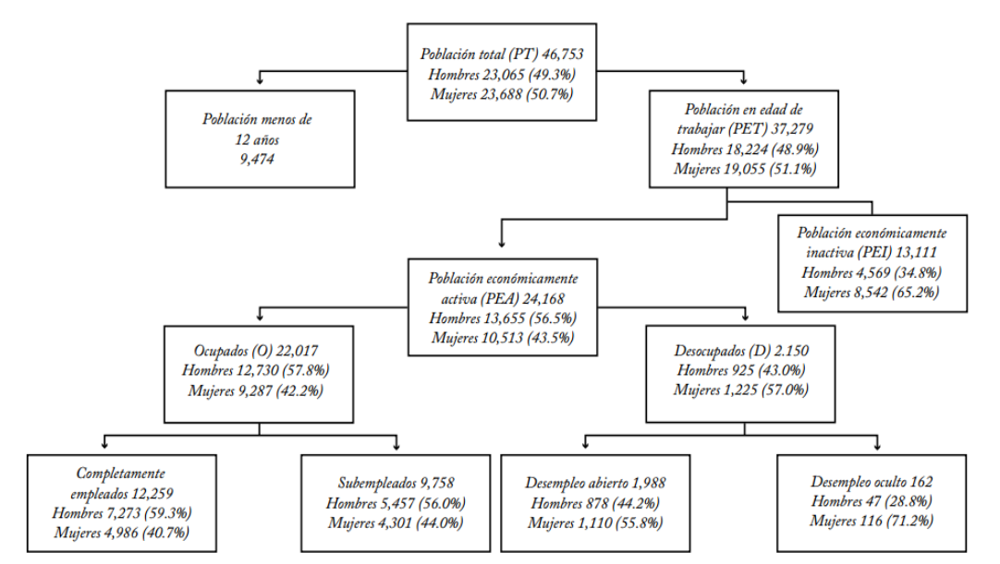

```{r meta, echo=FALSE}
library(metathis)
meta() %>%
  meta_general(
    description = "Desempleo",
    generator = "xaringan and remark.js"
  ) %>% 
  meta_name("github-repo" = "keynes37/xaringan-rladies-xalapa") %>% 
  meta_social(
    title = "Inflación-Precios",
    url = "https://spcanelon.github.io/xaringan-rladies-xalapa",
    image = "https://github.com/spcanelon/xaringan-rladies-xalapa/blob/master/xaringan-rladies-xalapa-general.png",
    image_alt = "Diapositiva para introducción a la economía",
    og_type = "website",
    og_author = "Carlos Yanes",
    twitter_card_type = "summary_large_image",
    twitter_creator = "@keynes37"
  )
```

```{r configuracion, include = FALSE}
library(pacman)
p_load(broom, latex2exp, ggplot2, ggthemes, ggforce, viridis, dplyr, magrittr, knitr, parallel, flextable, xaringanExtra, knitr, tidyverse, emo, fontawesome, datos, babynames, treemapify, shiny, kableExtra, plotly, econocharts, hrbrthemes, DiagrammeR)

#color
red <- "#b92e34"

# set default options
opts_chunk$set(comment = "#>",
               echo=FALSE,
               collapse = TRUE,
               dpi = 300)
#knit_engines$set("yaml", "markdown")
#xaringanExtra::use_tile_view()
#xaringanExtra::use_clipboard()
#xaringanExtra::use_share_again()
#xaringanExtra::style_share_again(
#share_buttons = c("twitter", "linkedin", "pocket")
#)
```

class: right, middle, inverse, titular
background-image: url(images/desempleo02.jpg)
background-size: contain
background-position: -8cm 20% 

<!---->

# `r rmarkdown::metadata$title` 
## **`r rmarkdown::metadata$subtitle`**
### `r rmarkdown::metadata$author`
### `r rmarkdown::metadata$date`

[`r fontawesome::fa("link")` Departamento de Economía](https://www.uninorte.edu.co/en/web/economia)

---
class: middle, inverse
.left-column[

# 😓 

]

.right-column[
# Preguntas de las sesiones anteriores?
]
---
class: center, middle
# Desempleo 🥶

----

---
class: left, middle, inverse, titular
background-image: url(images/desempleo01.jpg)
background-size: contain
background-position: 10cm 60% 

## Desempleo

#### Estado de insatisfacción
#### Deseo por sentirse
#### útil y productivo.

---
# Definición

--

Los trabajadores potenciales de una economía podemos dividirlos en tres categorías: **ocupados**, .hi[desempleados] y adicionalmente los .b[inactivos].

--

El .hi-slate[nivel de empleo] y el nivel .hi-orange[salarial] se determinan por la demanda de mano de obra por parte de las empresas y por la oferta de conocimientos y habilidades de los trabajadores y ademas por *rigideces salariales*.

--

#### Estados de desempleo

--

El desempleo .ul[friccional] se produce porque un trabajador desempleado tarda algún tiempo en conocer el estado del mercado de trabajo y en encontrar un nuevo puesto.

--

El desempleo .ul[estructural] se debe a que las *rigideces salariales* impiden que la cantidad de mano de obra demandada se iguale con la ofrecida.

--

El desempleo .ul[cíclico] es la diferencia entre la tasa de desempleo y su promedio a largo plazo.


---
class: inverse, two-colors
# Introducción
----
> Es muy importante resaltar la clasificación y el cálculo de las personas que se encuentran en la estructura laboral de una sociedad. Las métricas apoyan un diagnostico óptimo que lleva a establecer politicas públicas adecuadas.

--

.center[
.pull-left[

<font size="+5">PET</font>
]

.pull-right[

<font size="+5">PEA + PEI</font>
]
]
---
class: inverse, two-colors
# Introducción

--

.pull-right[
+ .orange[PET]: Población en edad a trabajar
  + Urbano 12 años
  + Rural 10 años (desde los 8)
<br/>
+ .orange[PEA]: Incluye a quienes trabajan o están buscando empleo en el período de referencia. 
  + Disponibilidad de trabajo
  
+ .orange[PEA]: Población Económicamente inactiva. 
  + Amas de casa, pensionados, discapacitados, rentistas.
  + "No tienen interés de trabajar".
]

---
class: inverse, two-colors
# Introducción

--

La clasificación hace útil las métricas de saber como laboralmente estamos
<br/>
<br/>
<br/>
<br/>

--

.center[
.pull-left[

<font size="+5">Ocupados</font>
]

.pull-right[

<font size="+5">Desempleados</font>
]
]
---
# Introducción

--

### Recuerde entonces

--

.hi[Trabajadores potenciales]

--

Todos los miembros de una población menos:

+ Menores de 12 años (urbano) y 10 años rurales.
+ Militares activos.
+ Personas hospitalizadas (cuidados intensivos) o encarceladas.

--

Los trabajadores .hi[potenciales] se pueden clasificar entonces como:

1. **Ocupados**: personas con un trabajo remunerado a tiempo parcial o completo.

2.  **Desempleados**: personas sin un trabajo pero que buscan uno activamente.

3. **Inactivos**: personas sin un trabajo y que no buscan uno activamente.

---
class: inverse, middle, center
background-image: url(https://upload.wikimedia.org/wikipedia/commons/6/60/Shuriken_%28Naruto%29.svg)
background-size: contain

# Intentemos responder a lo siguiente


---
# Preguntas 😧

--

**¿Cómo clasificaría a las siguientes personas segun sean ocupados, desempleados o inactivos?**

--

`r fa("faucet", fill="blue")` Electricista de Aire-co.

--

`r fa("faucet", fill="blue")` Persona de servicios generales a tiempo parcial.

--

`r fa("faucet", fill="blue")` Ex-trabajador del sector industrial buscando trabajo.

--

`r fa("faucet", fill="blue")` Ex-trabajador del sector industrial con una baja indefinida.

--

`r fa("faucet", fill="blue")` Estudiante universitario a tiempo completo.

--

`r fa("faucet", fill="blue")` Abuela pensionada.

--

`r fa("faucet", fill="blue")` Padre, amo de casa.

---
# Preguntas 😧

--

**Pregunta general:** Si la tasa de desempleo disminuye en un 3% con respecto al mismo mes del año pasado, podríamos decir que surge de

--

> **A.** Una recesión, cuando las empresas tienden a despedir trabajadores.<br/>
> **B.** Una expansión, cuando las empresas tienden a contratar trabajadores.<br/>
> **C.** Un “periodo normal” cuando las empresas hacen las dos cosas (contratar y despedir) y ajustan sus nomina.<br/>
> **D.** Un decreto de presidencia de la república que le dice a las empresas que contraten mas trabajadores.

---
# Preguntas 😧


**Pregunta general:** Si la tasa de desempleo disminuye en un 3% con respecto al mismo mes del año pasado, podríamos decir que surge de


> **A.** Una recesión, cuando las empresas tienden a despedir trabajadores.<br/>
> .hi[**B.** Una expansión, cuando las empresas tienden a contratar trabajadores.]<br/>
> **C.** Un “periodo normal” cuando las empresas hacen las dos cosas (contratar y despedir) y ajustan sus nomina.<br/>
> **D.** Un decreto de presidencia de la república que le dice a las empresas que contraten mas trabajadores.

---
# Preguntas 😧

--

**Pregunta general:** Si las personas que trabajan en cierto país son de 23'415.200 y las desempleadas alcanzan a ser de 2'575.672. La tasa de desempleo viene a ser:

--

> **A.** Alta (dos dígitos), un 11%.<br/>
> **B.** Alta (dos dígitos), un 18%.<br/>
> **C.** Baja (un dígito), un 7.8%.<br/>
> **D.** Normal (un dígito), un 3.4%.

---
# Preguntas 😧


**Pregunta general:** Si las personas que trabajan en cierto país son de 23'415.200 y las desempleadas alcanzan a ser de 2'575.672. La tasa de desempleo viene a ser:


> .hi[**A.** Alta (dos dígitos), un 11%.]<br/>
> **B.** Alta (dos dígitos), un 18%.<br/>
> **C.** Baja (un dígito), un 7.8%.<br/>
> **D.** Normal (un dígito), un 3.4%.

---
# Preguntas 😧

--

**Pregunta general:** Si la tasa de desempleo nunca llega a ser cero (0%), esto se debe a:

--

> **A.** La tasa cíclica de la economía.<br/>
> **B.** La tasa estructural de la economía.<br/>
> **C.** La tasa de interés de la economía.<br/>
> **D.** La tasa friccional de la economía.

---
# Preguntas 😧


**Pregunta general:** Si la tasa de desempleo nunca llega a ser cero (0%), esto se debe a:


> **A.** La tasa cíclica de la economía.<br/>
> **B.** La tasa estructural de la economía.<br/>
> **C.** La tasa de interés de la economía.<br/>
> .hi[**D.** La tasa friccional de la economía.]


---
class: inverse, middle, center
background-image: url(https://upload.wikimedia.org/wikipedia/commons/7/7e/Mudra-Naruto-KageBunshin.svg)
background-size: contain

# Como calculamos a los desempleados 🤔

---
# Desempleados

--

Tome como referencia la formula de:

--

<font size="+5">$$TD=\frac{Desempleados}{PEA}$$</font>

--

> Digamos que por un momento una economía tiene 1'945.626 personal actualmente desempleadas y buscando trabajo y la población economicamente activa alcanza a ser de 11'378.945 ciudadano, cuánto es su tasa de desempleo?

--

<font size="+5">$$TD=\frac{1'945.626}{11'378.945}= 17.1\%$$</font>

---
class: inverse, middle, right
background-image: url(https://upload.wikimedia.org/wikipedia/commons/7/7e/Mudra-Naruto-KageBunshin.svg)
background-size: contain

# ¿Cuantos desempleados debo tener para poseer una tasa de 5.5%?

---
# Desempleados

--

<font size="+5">$$5.5\%=\frac{Desempleados?}{11'378.945}$$</font>

--

<font size="+5">$$11'378.945\times 5.5\%=625.842$$</font>

--

LUEGO HAY QUE CONSEGUIRLE TRABAJO A:<br/> 

<center>
<font size="+5">1'319.784 personas</font>
</center>

---
# Desempleados

--

Podemos aun encontrar otras clasificaciones de la estructura del empleo y estas parten del concepto de .hi[DESEMPLEADOS].

--

.pull-left[
+ .hi-slate[Desempleo oculto]: Aquellos que no buscaron trabajo el ultimo mes pero si los 12 meses antes.
]

--

.pull-right[
+ .hi-slate[Desempleo abierto]: Aquellos que buscaron trabajo el ultimo mes.
]

---
class: classificator

.mi-cuadro[Los **empleados** también poseen ciertas características que los clasifican y diferencian de los otros conceptos]

---
# Tipos de ocupados

--

.pull-left[
+ .hi[Plenamente ocupados]: Aquellos individuos que no desean trabajar **mas** estando empleados.
]

--

.pull-right[
+ .hi[Subempleados]: De acuerdo a lo que hacen:

`r fa("fighter-jet")` Por .ul[competencia]: Aquellas personas que laboran en actividades distintas a las que fue formado. _P.e_ Economista manejando un taxi.

`r fa("fighter-jet")` Por .ul[insuficiencia de horas]: Aquellos que deseean trabajar mas horas de las que han sido pactadas por su empleador y no pueden.

`r fa("fighter-jet")` Por .ul[insuficiencia de ingresos]: Si en el sitio donde trabaja no cuenta con los recursos y elementos para realizar sus labores de acuerdo a lo que opta o desea hacer en ese trabajo.

]
---
# Tipos de ocupados

--


<br>
Fuente: Lora y Prada (2013)

---
class: inverse, middle, center
background-image: url(https://upload.wikimedia.org/wikipedia/commons/7/7e/Mudra-Naruto-KageBunshin.svg)
background-size: contain

# Qué otras formulas adicionales hay para esto? 😠

---
# Formulas e indicadores del mercado laboral

--

### Formulas adicionales

--

<font size="+5">$$TBP=\frac{PEA}{PT}\times 100$$</font>

> Esta tasa nos indica la carga que tiene la oferta laboral en el país. El grupo de personas que esta dispuesta y disponible a trabajar.

--

<font size="+5">$$TGP=\frac{PEA}{PET}\times 100$$</font>

> A diferencia de la anterior nos dice mejor cuantos estan en disposición a trabajar.

---
# Formulas e indicadores del mercado laboral

--

### Formulas adicionales

--


<font size="+5">$$TS=\frac{Subempleados}{PEA}\times 100$$</font>

> La tasa de subempleo es otro indicador sustancioso. Esperamos siempre que sea bajo. Una economía con alto subempleo no lleva al bienestar al resto de habitantes

--

<font size="+5">$$TO=\frac{Ocupados}{PET}\times 100$$</font>

> La tasa de ocupación nos dice cuantos estan ocupados realmente en nuestra economía. 

---
# Formulas e indicadores del mercado laboral

--

```{R, graphoui, echo = F, fig.height = 5, fig.width = 9, dev = "svg"}
Car <- c("TGP", "TO", "TD")
S_2023 <- c(64.2, 58.3, 9.3)
S_2024 <- c(63.5, 57.7, 9.1)
data <- data.frame(Car, S_2023, S_2024)

data_long<- data%>%
  gather("Periodo", "Valor", -Car)

# Crear el gráfico de barras
ggplot(data_long, aes(x=Car, y=Valor, fill=Periodo))+
  geom_col(position = "dodge")+
  scale_fill_manual(
    "Periodo",
    labels = c("2023", "2024"),
    values = c("darkslategray","#f92672"))+
  labs(x = "Indicadores", y = "Porcentaje (%)", title = "Comparación de Indicadores del Mercado Septiembre 2023 vs. 2024",
       subtitle = "DANE Septiembre 2024") +
  ggthemes::theme_pander(base_size = 17) +
  theme(legend.position = "right")
```

---
# Formulas e indicadores del mercado laboral

--

### Grupo especifico

--

```{r, echo=FALSE}
tabla <- data.frame(
  Car = c("Hombres", "Hombres", "Hombres"),
  Edad = c("12-19", "20-29", "30 y mas"),
  Formula = c("204.042/1.201.902", "370.773/3.267.355", "486.833/8.652.150"),
  Desempleo= c("16.98%", "11.35%", "5.63%")
)
kable(tabla, align = "c", format = "html", escape = F,
      col.names = c(
        " ",
        "Grupo de edad",
        "D.sub[i]/PEA.sub[i]",
        "Tasa específica de desempleo"
      )) %>%
  kable_styling(bootstrap_options = "striped", full_width = F)%>%
  collapse_rows(columns = 1,
                valign = "middle")
```


---
class: inverse, middle

# Como contrata una firma 😮

---
# Como contrata una firma

--

Suponga por un momento que usted produce y vende caja de .hi[Bananos] y el precio es de $7 y los salarios que usted paga -*por el mercado trabajo*- es de 3000 por mes, .b[Cuántos trabajadores debe contratar?]

--

```{R, echo = F, escape = F}
data.frame(
  v1 = c(0, 1, 2, 3, 4, 5),
  v2 = c(0, 1000, 1900, 2200, 2400, 2600),
  v3 = c("", "", "", "", "", ""),
  v4 = c("", "", "", "", "", ""),
  v5 = c("$3000", "$3000", "$3000", "$3000", "$3000", "$3000")
) %>% kable(
  escape = F,
  col.names = c("Trabajadores (L)", "Bananos (Q)", "Producto Marginal", "Producto Marginal &times; P", "Salario"),
  align = c("c", "c", "c", "c", "c")#,
) %>%
row_spec(1:6, color = red) %>%
row_spec(1:6, extra_css = "line-height: 110%;")
```
---
# Como contrata una firma


Suponga por un momento que usted produce y vende caja de .hi[Bananos] y el precio es de $7 y los salarios que usted paga -*por el mercado trabajo*- es de 3000 por mes, .b[Cuántos trabajadores debe contratar?]


```{R, echo = F, escape = F}
data.frame(
    v1 = c(0, 1, 2, 3, 4, 5),
  v2 = c(0, 1000, 1900, 2200, 2400, 2500),
  v3 = c("&mdash;", 1000, 900, 300, 200, 100),
  v4 = c("", "", "", "", "", ""),
  v5 = c("$3000", "$3000", "$3000", "$3000", "$3000", "$3000")
) %>% kable(
  escape = F,
  col.names = c("Trabajadores (L)", "Bananos (Q)", "Producto Marginal", "Producto Marginal &times; P", "Salario"),
  align = c("c", "c", "c", "c", "c")#,
) %>%
row_spec(1:6, color = red) %>%
row_spec(1:6, extra_css = "line-height: 110%;")
```

---
# Como contrata una firma


Suponga por un momento que usted produce y vende caja de .hi[Bananos] y el precio es de $7 y los salarios que usted paga -*por el mercado trabajo*- es de 3000 por mes, .b[Cuántos trabajadores debe contratar?]


```{R, echo = F, escape = F}
data.frame(
    v1 = c(0, 1, 2, 3, 4, 5),
  v2 = c(0, 1000, 1900, 2200, 2400, 2500),
  v3 = c("&mdash;", 1000, 900, 300, 200, 100),
  v4 = c("&mdash;", "7000", "6300", "2100", "1400", "700"),
  v5 = c("$3000", "$3000", "$3000", "$3000", "$3000", "$3000")
) %>% kable(
  escape = F,
  col.names = c("Trabajadores (L)", "Bananos (Q)", "Producto Marginal", "Producto Marginal &times; P", "Salario"),
  align = c("c", "c", "c", "c", "c")#,
) %>%
row_spec(1:6, color = red) %>%
row_spec(1:6, extra_css = "line-height: 110%;")
```

--

La clave siempre será: 

.hi-blue[**Pensando marginalmente:**] Se mantiene el contrato siempre que .hi[Producto Marginal &times; P] $\geq$ .blue[**Salarios**].

--

Por ende, la mejor manera es .hi[contratar] solo **2 Personas**.

---
class: inverse, middle, center
background-image: url(https://media.giphy.com/media/DAtJCG1t3im1G/giphy.gif)
background-size: cover

---
# Bibliografía

`r fa('book')` Lora, E., & Prada, S. I. (2008). *Técnicas de medición económica*. Metodología y aplicaciones en Colombia, ICESI.

`r fa('book')` Mateer, D., & Coppock, L. (2021). *Principles of Microeconomics.* WW Norton & Company.

`r fa('book')` Acemoglu, D., Laibson, D., & List, J. A. (2017). *Economía*. Antoni Bosch editor.

`r fa('book')` Informes de desempleo DANE 2021 y 2022 

---
name: adios
class: middle, inverse

.pull-left[
# **¡Gracias!**
<br/>
## Desempleo

]

.pull-right[
.right[


[`r fontawesome::fa("link")` Syllabus/ Curso](https://pomelo.uninorte.edu.co/pls/prod/bwckctlg.p_disp_course_detail?cat_term_in=202210&subj_code_in=ECO&crse_numb_in=0010)<br/>
[`r fontawesome::fa("twitter")` @keynes37](https://twitter.com/keynes37)<br/>
[`r fontawesome::fa("paper-plane")` cayanes@uninorte.edu.co](mailto:cayanes@uninorte.edu.co)
]
]

???
¡Gracias por tu atención! 
En este momento me encantaría tomar preguntas y si me quieren contactar no olviden enviar un email.


